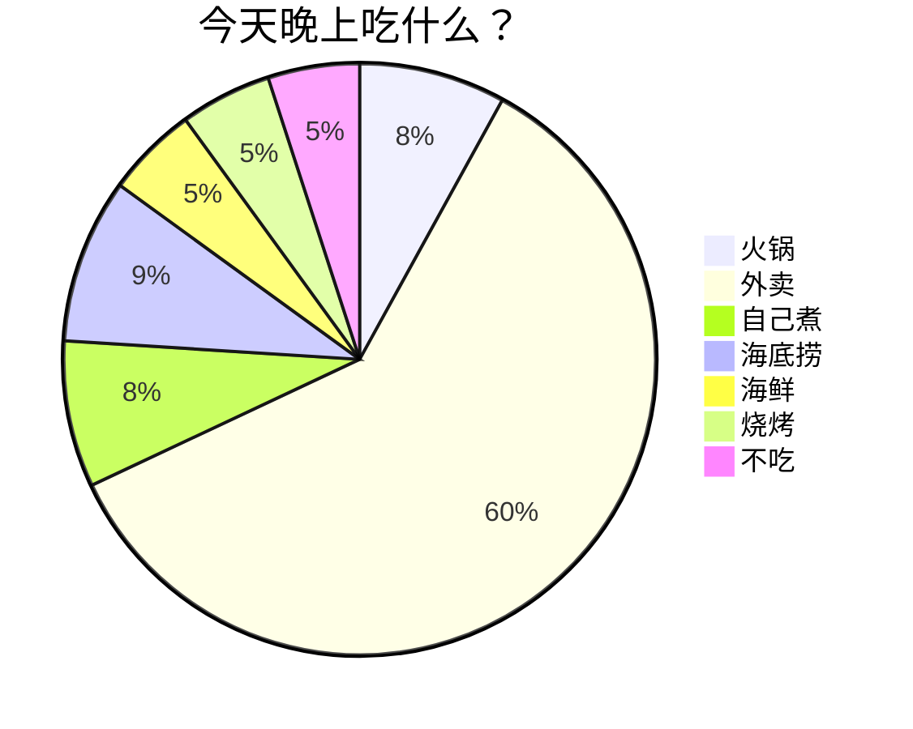
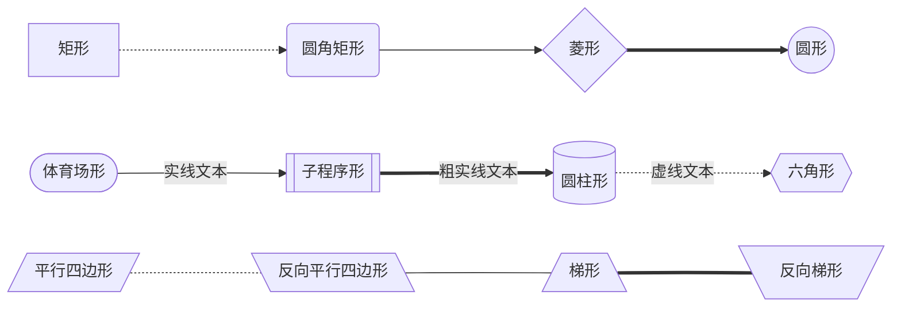
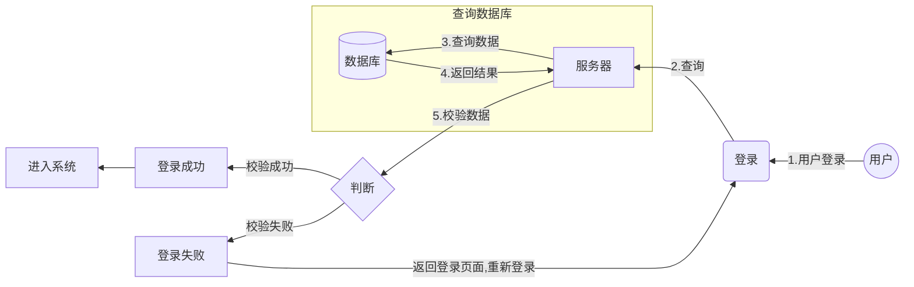
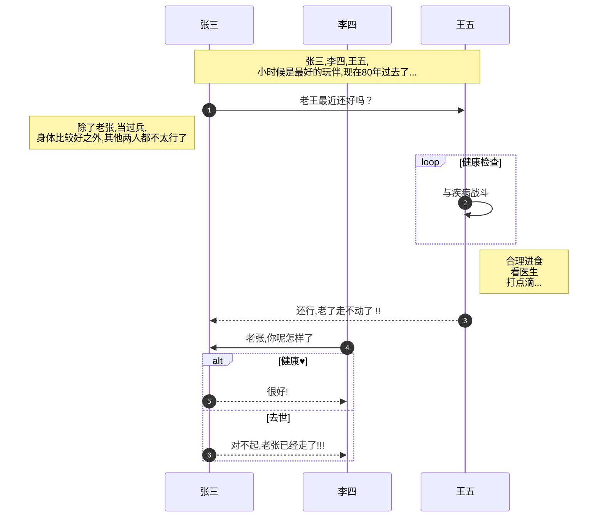
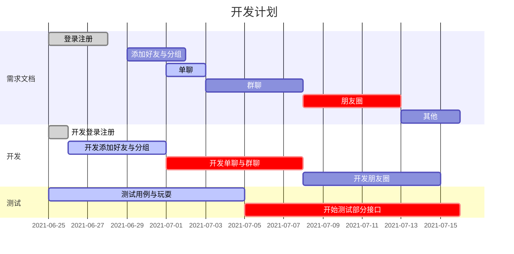
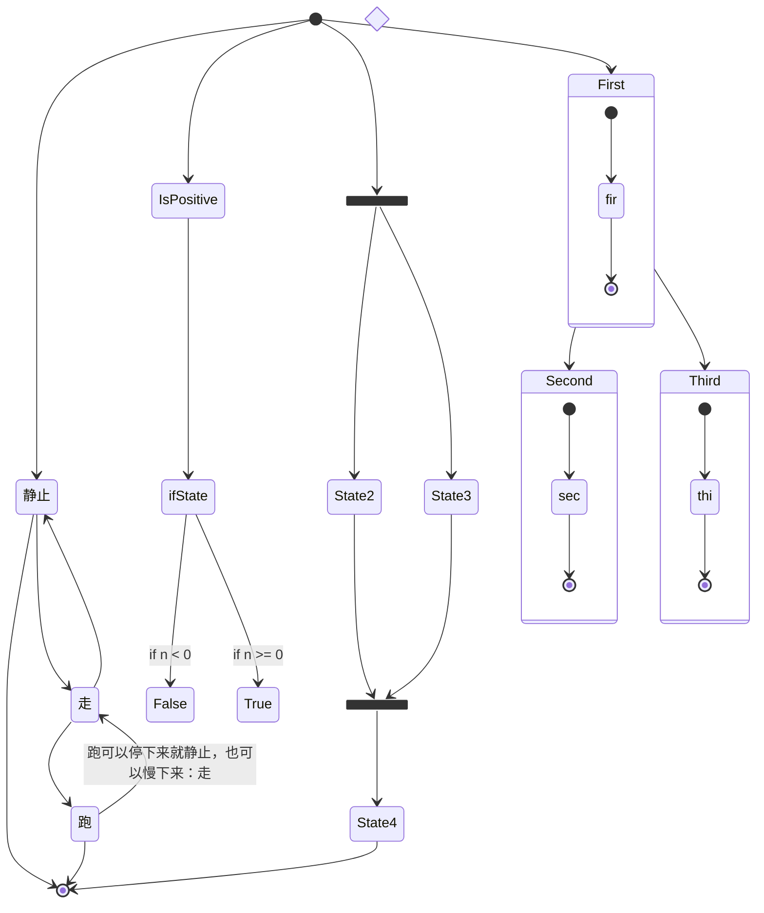
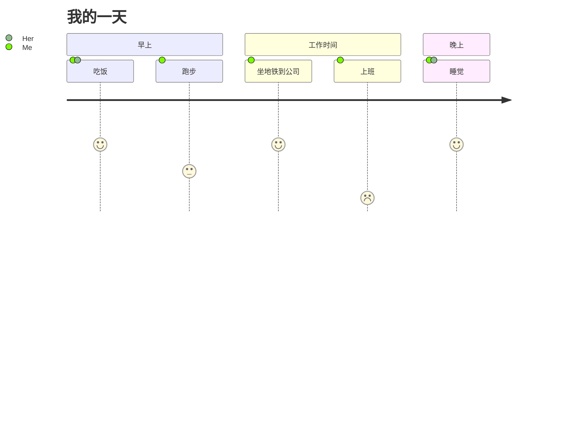

### 一、Markdown 流程图语法示例
+ 不在 Markdown 涵盖范围之内的标签，都可以直接在文档里面用 HTML 撰写。
+ 目前支持的 HTML 元素有：`<kbd>`、`<b>`、`<i>`、`<em>`、`<sup>`、`<sub>` `<br>`
+ 使用 <kbd>Ctrl</kbd>+<kbd>Alt</kbd>+<kbd>Del</kbd> 重启电脑

<!--more-->

### 二、mermaid
+ Mermaid是一种基于Javascript的绘图工具，使用类似于Markdown的语法，
+ 使用户可以方便快捷地通过代码创建图表。

**Mermaid能绘制哪些图？**
+ **饼状图：** 使用 `pie` 关键字
+ **流程图：** 使用 `graph`或`flowchart` 关键字
+ **时序图：** 使用 `sequenceDiagram` 关键字
+ **甘特图：** 使用 `gantt` 关键字
+ **类图：** 使用 `classDiagram` 关键字
+ **状态图：** 使用 `stateDiagram` 关键字
+ **用户旅程图：** 使用 `journey` 关键字
+ 具体用法后文将详细介绍


#### 1、饼状图
+ 这种语法最简单
+ 第一行指定关键字为`pie`,后面就是标题加内容了
+ 还有就是标题是**可选的**，标题下面就是数据部分
+ 代码示例如下:

```js
// 下面我多了个空格,后面例子也是多个空格
	`` `mermaid
	pie
        title 今天晚上吃什么？
        "火锅" : 8
        "外卖" : 60
        "自己煮" : 8
        "海底捞" : 9
        "海鲜" : 5
        "烧烤" : 5
        "不吃" : 5
	`` `
```
+ 示例图如下:



+ 通过示例图和代码示例,应该就知道语法怎样写了


#### 2、流程图
+ 代码开头第一行：graph +“方向” 
+ 这个方向是指流程图走的方向，一共有四个方向
+ 上往下(TD/TB)、下往上(BT,DT有些编辑器不支持:Typora)、左往右(LR)、右往左(RL) 
+ `T=Top`     `D/B=Down/Bottom`   ` L=Left`      `R=Right` 
+ 注释：在行首加入`%%`即可

**①、图案:**
+ 如下：方括号代表矩形，圆括号代表圆角矩形，大括号代表菱形，就不一一解释了。
+ `[矩形]`、`(圆角矩形)` 、`{菱形}`、`((圆形))`
+ `([体育场形])`、`[[子程序形]]`、`[(圆柱形)]`、`{{六角形}}` 
+ `[/平行四边形/]`、`[\反向平行四边形\]`、`[/梯形\]`、`[\反向梯形/]`

**②、线条样式**
+ 虚线箭头：`-.->`
+ 实线箭头:  `-->`
+ 粗实线箭头: `==>`
+ 文本箭头
	+ 实线文本箭头:`--本文内容-->`
	+ 粗实线文本箭头:`==本文内容==>`
	+ 虚线文本箭头: `-.文本.->`
+ 无箭头: 就是以上箭头方式,去掉箭头即可,例: `-.-` 、`---`、`===`

**③、形状与线条连接示例代码:**

```js
    `` `mermaid
    graph LR
    A[矩形] -.->B(圆角矩形) --> C{菱形} ==> D((圆形)) 
    E([体育场形])--实线文本--> F[[子程序形]]==粗实线文本==>G[(圆柱形)]-.虚线文本.->H{{六角形}}
    I[/平行四边形/]-.-J[\反向平行四边形\]---K[/梯形\]===L[\反向梯形/]

    `` `
```

*形状与线条连接示例图如下：*




**④、还有其他连线:**
+ 就是把上面所有连线方式的箭头改为两头都有特殊符号:`o`、`x`、`< >`
+ 但是要把`graph` 改为 `flowchart` 
+ 如下示例

```js
    `` `mermaid
    flowchart LR
    A1[矩形] o--o B1(圆角矩形) <--> C1{菱形} x--x D1((圆形))
    A2[矩形] o-.-o B2(圆角矩形) <-.-> C2{菱形} x-.-x D2((圆形))
    A3[矩形] o==o B3(圆角矩形) <==> C3{菱形} x==x D3((圆形))

    `` `
```

*示例图:*


**⑤、实战综合示例**

+ 代码示例

```js
    `` `mermaid
graph RL

        User((用户))--1.用户登录-->Login(登录)
        Login --2.查询-->SERVER[服务器]
 subgraph 查询数据库
        SERVER--3.查询数据-->DB[(数据库)]
        DB--4.返回结果-->SERVER
 end
        SERVER--5.校验数据-->Condition{判断}
        Condition -->|校验成功| OK[登录成功]
        Condition -->|校验失败| ERR[登录失败]
        OK-->SYS[进入系统]

        ERR -->|返回登录页面,重新登录| Login
    `` `
```

*示例图:*




+ subgraph 子图，可以把几个步骤合到一起，`direction` 定义方向(但是Typora不支持，)

```
subgraph title
	direction TB
    定义步骤
end
```


#### 3、时序图
+ 先啥也不说,先看简单源码示例:

```js
    `` `mermaid
    %% 时序图例子,-> 直线，-->虚线，->>实线箭头
      sequenceDiagram
		autonumber
        participant Z as 张三
        participant L as 李四
        participant W as 王五

        Note over Z,W: 张三,李四,王五,<br/>小时候是最好的玩伴,现在80年过去了...
        Z->>W: 老王最近还好吗？
        Note left of Z: 除了老张,当过兵,<br/>身体比较好之外,其他两人都不太行了
        loop 健康检查
            W->>W: 与疾病战斗
        end
        Note right of W: 合理进食 <br/>看医生<br/>打点滴...
        W-->>Z: 还行,老了走不动了 !!
        L->>Z: 老张,你呢怎样了
        alt 健康#9829;
        Z-->>L: 很好!
        else 去世
        Z-->>L: 对不起,老张已经走了!!!
        end
    `` `
```

*示例图如下:*


    
    
    

+ 语法结构,第一行使用:`sequenceDiagram`
+ 使用：`autonumber`可以自动标注次数
+ 使用别名: `participant 别名 as 显示名称`
+ 注释标注内容:
    + 格式:`Note over 参与者1,参与者2: 注释内容` 两个参与者之间显示
    + 格式:`Note left of 参与者1: 注释内容` 在 参与者1 左边显示
    + 格式:`Note right of 参与者1: 注释内容` 在 参与者1 右边显示
+ 线条:`-> 实线`、`->>实线箭头`、`-->虚线`、`-->>虚线+箭头`、`-x带叉的线`、
+ 背景高亮可以使用：`rect rgb(0, 255, 0) ... end`


```
rect rgba(0, 0, 255, .1)
... content ...
end
```


+ 自循环使用 `loop ... end`

```js
loop 循环的条件
    循环体描述语句
end
```

+ 判断使用 `alt ... else ...else ... end`,如果没有else可以使用：`opt .... end `

```js
alt 条件 1 描述
    分支 1 描述语句
else 条件 2 描述 
    分支 2 描述语句
else ...
    ...
end


// 没有else 可以用如下语法：
opt 条件描述
    分支描述语句
end
```


#### 4、甘特图
+ 甘特图是一类条形图，由Karol Adamiechi在1896年提出, 而在1910年Henry Gantt也独立的提出了此种图形表示。
+ 通常用在对项目终端元素和总结元素的开始及完成时间进行的描述。

|标记|	简介|
|--|--|
|title|	标题|
|dateFormat|	日期格式|
|section|	模块,定义纵方向上的|
|done|	已经完成|
|active|	当前正在进行|
|crit|	关键阶段紧急的，将高亮显示|
|after|	默认从上一项结束时间开始|


**格式：**

```js
// 定义日期格式
dateFormat  YYYY-MM-DD

//定义标题
title 标题

// 定义模块
section 模块

// 定义模块下的步骤
步骤描述:步骤状态,ID,开始日期,结束日期
步骤描述:步骤状态,ID,开始日期,天数/小时
步骤描述:ID,开始日期,天数/小时
步骤描述:天数/小时


// 时间格式有： 1h、1d、1w、
```

+ 如下源码示例

```js
`` `mermaid
gantt

dateFormat YYYY-MM-DD
title 开发计划

section 需求文档
	登录注册:done,login,2021-06-25,2021-06-28
	添加好友与分组:add, 2021-06-29,3d
	单聊 :active ,chat, 2021-07-01,2d
	群聊 :groupChat,after chat,5d
	朋友圈 :crit,5d
	其他:3d
section 开发
	开发登录注册:done,d-login,2021-06-25,24h
	开发添加好友与分组:active,d-add,after d-login,5d
	开发单聊与群聊:crit,d-chat,after d-add,7d
	开发朋友圈:d-friend,after d-chat,7d
	
section 测试
	测试用例与玩耍:active,test,2021-06-25,10d
	开始测试部分接口:crit,start-test,after test,11d
`` `
```

+ 示例图如下：




+ 注意：ID不能重复


#### 5、类图
+ 使用 `classDiagram` 关键字

+ 然后和写java代码一样用class定义类，其属性和方法

+ 然后通过线条连接两者之间的关系

+ 格式：`类1 线条 类2:备注`

+ 线条有：`<|--`、`*--`、`o--`、`..`、`<-->`、`--|>`、

**类的注释：**

- `<<Interface>>` 表示接口类
- `<<abstract>>` 表示抽象类
- `<<Service>>` 表示服务类
- `<<enumeration>>` 代表一个枚举

**源码示例：**

```js
`` `mermaid
classDiagram

class Serializable{
<<interface>>
}
class Throwable{
<<class>>
 String detailMessage;
 Object backtrace;
 Throwable();
}

class Exception{
<<class>>
Exception()
Exception(String message)
}
class IOException{
	<<class>>
}

class SocketException{
	
}

class RuntimeException{
<<class>>
}

class IndexOutOfBoundsException{
	
}

class ArithmeticException{
	
}

Serializable <|.. Throwable:序列化接口
Throwable *--Exception
Exception <-- RuntimeException:运行时异常
Exception <-- IOException:io流相关异常
IOException o-- SocketException
RuntimeException o-- IndexOutOfBoundsException
RuntimeException o-- ArithmeticException

`` `

```
*示例图：*


#### 6、状态图
+ 使用 `stateDiagram` 关键字

**先上一波源码示例：**
```js
    `` `mermaid
    stateDiagram-v2

        [*] --> 静止
        静止 --> [*]
        静止 --> 走
        走 --> 静止
        走 --> 跑
        跑 --> 走:跑可以停下来就静止，也可以慢下来：走
        跑 --> [*]


        state if_state <<choice>>
        [*] --> IsPositive
        IsPositive --> if_state
        if_state --> False: if n < 0
        if_state --> True : if n >= 0


        state fork_state <<fork>>
          [*] --> fork_state
          fork_state --> State2
          fork_state --> State3

          state join_state <<join>>
          State2 --> join_state
          State3 --> join_state
          join_state --> State4
          State4 --> [*]

        [*] --> First
        First --> Second
        First --> Third

        state First {
            [*] --> fir
            fir --> [*]
        }
        state Second {
            [*] --> sec
            sec --> [*]
        }
        state Third {
            [*] --> thi
            thi --> [*]
        }

    `` `

```

*示例图：*




+ 有两种特殊状态指示图表的开始和停止。
+ 这些是用 `[*]` 语法编写的，转换的方向将其定义为开始或停止状态。
+ 转换是一种状态进入另一种状态时的路径，使用箭头“-->”表示
+ 在实际使用状态图时，您经常会得到多维的图，因为一个状态可以有多个内部状态。这些在本术语中称为复合状态。
+ 为了定义复合状态，您需要使用 `state` 关键字，后跟一个` id` 和 `{}` 之间复合状态的主体。
+ 如下示例：

```
[*] --> First
First --> Second
First --> Third

state First {
[*] --> fir
fir --> [*]
}

state Second {
[*] --> sec
sec --> [*]
}

state Third {
[*] --> thi
thi --> [*]
}

```


#### 6、用户旅程图
+ 使用 `classDiagram` 关键字
+ 格式：`任务:分数：角色列表（多个用逗号隔开）`

**代码示例：**
```js
`` `mermaid
journey
    title 我的一天
    section 早上
      吃饭: 5: Me,Her
      跑步: 3: Me
    section 工作时间
       坐地铁到公司: 5 :Me
       上班: 1:Me
    section 晚上
      睡觉: 5: Me,Her

`` `
```

*示例图：*



+ 分数越高心情越好

### 三、flow
+ 标准流程图
+ 代码主要有两个部分组成：
    + 第一部分：定义元素
    + 第二部分：定义元素的方向
    **先看看源码示例**
```js
`` `flow
    st=>start: 开始框
    op=>operation: 处理框
    cond=>condition: 判断框(是或否?)
    sub1=>subroutine: 子流程
    io=>inputoutput: 输入输出框
    e=>end: 结束框
    st->op->cond
    cond(yes)->io->e
    cond(no)->sub1(right)->op
`` `
```
+ 以上代码的示例图


#### 1、元素的类型
+ **start** # 开始
+ **end** # 结束
+ **operation** # 操作
+ **subroutine** # 子程序
+ **condition** # 条件
+ **inputoutput** # 输入或产出 

#### 2、语法
+ 格式：`定义元素名称=>元素类型: 显示的节点内容`。(冒号后面要有个空格)
+ 定义元素类型用     `=>`
+ 连接两个元素用     `->`
+ 元素的方向可以使用：`left`、`right`、`top`、 `bottom`.


**还是上面的代码示例，只是加个方向，如下**：

```js
`` `flow
    st=>start: 开始框
    op=>operation: 处理框
    cond=>condition: 判断框(是或否?)
    sub1=>subroutine: 子流程
    io=>inputoutput: 输入输出框
    e=>end: 结束框
    st(right)->op(right)->cond
    cond(yes)->io(bottom)->e
    cond(no)->sub1(right)->op
`` `
```

+ 上面源码示例图如下：


+ 对比两个示例，我们知道默认是自上而下。


### 四、sequence
+ 时序图sequence
+ 和mermaid的时序图语法一致，只是生成的图，更精简而已。


##### ①、简单示例
```js
`` `sequence
    对象A->对象B: 对象B你好吗?（请求）
    Note right of 对象B: 对象B的描述
    Note left of 对象A: 对象A的描述(提示)
    对象B-->对象A: 我很好(响应)
    对象A->对象B: 你真的好吗？
`` `
```

+ 示例图如下：


##### ②、复杂示例
```js
`` `sequence
    
    对象A->对象B: 对象B你好吗?（请求）
    Note right of 对象B: 对象B的描述
    Note left of 对象A: 对象A的描述(提示)
    对象B-->对象A: 我很好(响应)
    对象B->小三: 你好吗
    小三-->>对象A: 对象B找我了
    对象A->对象B: 你真的好吗？
    Note over 小三,对象B: 我们是朋友
    participant C
    Note right of C: 没人陪我玩
`` `
```

+ 示例图如下：


