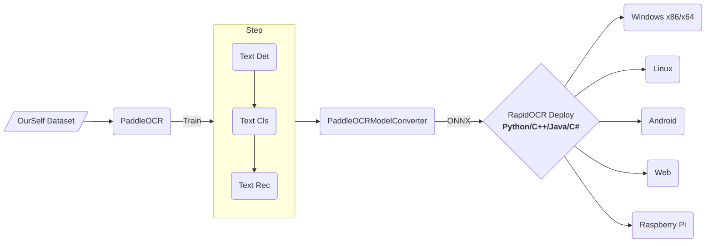

## RapidOCR

###  RapidOCR概述
- 💖目前已知**运行速度最快、支持最广**，完全开源免费并支持离线快速部署的多平台多语言OCR。
- **支持的语言**: 默认是中英文，其他语言识别需要自助转换。具体参考[这里](https://rapidai.github.io/RapidOCRDocs/docs/about_model/support_language/)
- **缘起**：[PaddleOCR](https://github.com/PaddlePaddle/PaddleOCR)工程化不是太好，为了方便大家在各种端上进行OCR推理，我们将PaddleOCR中的模型转换为ONNX格式，使用`Python/C++/Java/Swift/C#` 将它移植到各个平台。
- **名称来源**： 轻快好省并智能。基于深度学习的OCR技术，主打人工智能优势及小模型，以速度为使命，效果为主导。
- 使用：
    - 如果仓库下已有模型满足要求 → RapidOCR部署使用即可。
    - 不满足要求 → 基于PaddleOCR在自己数据上微调 → RapidOCR部署。
- 官方文档地址：[https://rapidai.github.io/RapidOCRDocs/docs/overview/](https://rapidai.github.io/RapidOCRDocs/docs/overview/)


### 一、整体框架



### 二、在线Demo

- Hugging Face上的Demo和魔搭Demo是同一套代码，都是基于[streamlit](https://streamlit.io/)搭建而来的。
- 两者区别在于，魔搭是国内平台，不需要科学上网即可访问使用；Hugging Face则需要科学上网。
- 搭建demo的目的在于：
    - 快速查看指定图像的识别效果和识别时长
    - 快速比较不同版本的检测和识别模型效果差异

#### 1、Demo源码 [*link*](https://rapidai.github.io/RapidOCRDocs/docs/online_demo/#demo源码)

- Hugging Face Demo: https://huggingface.co/spaces/SWHL/RapidOCRDemo/tree/main
- 魔搭社区: https://www.modelscope.cn/studios/liekkas/RapidOCRDemo/files

#### 2、在线Demo

- Hugging Face Demo: https://huggingface.co/spaces/SWHL/RapidOCRDemo
- 魔搭社区: https://www.modelscope.cn/studios/liekkas/RapidOCRDemo/summary

### 三、Java语言支持
- Github地址: [https://github.com/MyMonsterCat/RapidOcr-Java](https://github.com/MyMonsterCat/RapidOcr-Java)


#### 1、快速开始


**方式一：本地直接运行**

```shell
## 项目含有库文件，导致下载可能较慢
git clone https://github.com/MyMonsterCat/RapidOcr-Java.git


## 下载之后，直接可以运行：com.github.monster.ocr.OcrUtilTest
```


**方式二：引入其他项目**
- 在***方式一***中下载之后进行打包(`mv clean compile install`)，然后引入pom依赖，

- 不会打包可参考文档：(需要自己下载项目打包，过程参考[如何自行打包jar包？](https://github.com/MyMonsterCat/RapidOcr-Java/blob/main/docs/COMPILE_JAR.md))


```
<dependency>
    <groupId>com.github.monster</groupId>
    <artifactId>RapidOcr-Java</artifactId>
    <version>${latest.version}</version>
</dependency>
```

> 注意：如果是采用方式二打包，务必将src/resources下的ncnn或者onnx的库文件引入到自己的项目resources中


**调用测试：**

```java
public class OcrUtilTest {

    @Test
    public void NcnnTest() {
        // 使用NCNN引擎进行识别
        OcrResult NCNNResult = OcrUtil.runOcr(getResourcePath("/images/40.png"), LibConfig.getNcnnConfig(), ParamConfig.getDefaultConfig(), HardwareConfig.getNcnnConfig());
        Assert.assertEquals("40", NCNNResult.getStrRes().trim().toString());
    }

    @Test
    public void OnnxTest() {
        String imgPath = getResourcePath("/images/40.png");
        OcrResult ONNXResult = OcrUtil.runOcr(imgPath);
        Assert.assertEquals("40", ONNXResult.getStrRes().trim().toString());
    }

    @Test
    public void OnnxDrawTest() {
        String imgPath = getResourcePath("/images/test.png");
        String drawPath = imgPath.replace("test", "40-draw");
        File drawFile = new File(drawPath);
        // 使用ONNX推理引擎进行识别
        // 配置参数
        ParamConfig paramConfig = ParamConfig.getDefaultConfig();
        paramConfig.setDoAngle(true);
        paramConfig.setMostAngle(true);
        // 开始识别
        OcrResult ONNXResult = OcrUtil.runOcr(imgPath, LibConfig.getOnnxConfig(), paramConfig);
        // 绘制推理结果
        ArrayList<TextBlock> textBlocks = ONNXResult.getTextBlocks();
        FileUtil.copy(imgPath, drawPath, Boolean.TRUE);
        ByteArrayInputStream in = IoUtil.toStream(ImageUtil.drawImg(drawFile, textBlocks));
        FileUtil.writeFromStream(in, drawFile);
    }

    @Test
    public void paramTest() {
        // 配置参数
        ParamConfig paramConfig = ParamConfig.getDefaultConfig();
        paramConfig.setDoAngle(true);
        paramConfig.setMostAngle(true);
        // 开始识别
        OcrResult ocrResult = OcrUtil.runOcr(getResourcePath("/images/test.png"), LibConfig.getNcnnConfig(), paramConfig);
        System.out.println(ocrResult);
    }

    @Test
    public void hardWareTest() {
        // 配置可变参数
        ParamConfig paramConfig = ParamConfig.getDefaultConfig();
        paramConfig.setDoAngle(true);
        paramConfig.setMostAngle(true);
        // 配置硬件参数：4核CPU，使用GPU0
        HardwareConfig hardwareConfig = new HardwareConfig(4, 0);
        // 开始识别
        OcrResult ocrResult = OcrUtil.runOcr(getResourcePath("/images/test.png"), LibConfig.getNcnnConfig(), paramConfig, hardwareConfig);
        System.out.println(ocrResult);
    }

    @Test
    public void repeatOcr() {
        String real = "40";
        System.out.println("NCNN 1>>>>>>>> ");
        OcrResult NCNN_1 = OcrUtil.runOcr(getResourcePath("/images/40.png"));
        Assert.assertEquals(real, NCNN_1.getStrRes().trim().toString());

        System.out.println("NCNN 2>>>>>>>> ");
        OcrResult NCNN_2 = OcrUtil.runOcr(getResourcePath("/images/40.png"));
        Assert.assertEquals(real, NCNN_2.getStrRes().trim().toString());

        System.out.println("NCNN 3>>>>>>>> ");
        OcrResult NCNN_3 = OcrUtil.runOcr(getResourcePath("/images/40.png"));
        Assert.assertEquals(real, NCNN_3.getStrRes().trim().toString());

        System.out.println("NCNN 4>>>>>>>> ");
        OcrResult NCNN_4 = OcrUtil.runOcr(getResourcePath("/images/system.png"));
        Assert.assertEquals("System", NCNN_4.getStrRes().trim().toString());

        System.out.println("NCNN 5>>>>>>>> ");
        OcrResult NCNN_5 = OcrUtil.runOcr(getResourcePath("/images/40.png"));
        Assert.assertEquals(real, NCNN_5.getStrRes().trim().toString());
    }

    @SneakyThrows
    private static String getResourcePath(String path) {
        String encodePath = new File(OcrUtilTest.class.getResource(path).getFile()).toString();
        // 如果包含中文会转义，所以需要转回来
        return URLDecoder.decode(encodePath,"utf-8");
    }

}
```


#### 2、进阶使用

#####  :hourglass_flowing_sand: OcrConfig参数调优

**LibConfig**参数说明如下：

|    参数名    |                  说明                   |  类型   | 权限 |
| :----------: | :-------------------------------------: | :-----: | :--: |
|  libraryDir  |             动态链接库路径              | String  | 读写 |
|  modelsDir   |                模型路径                 | String  | 读写 |
| deleteOnExit | 是否在JVM退出时删除动态链接库和模型文件 | boolean | 读写 |
|   detName    |               Det文件名称               | String  | 只读 |
|   clsName    |               Cls文件名称               | String  | 只读 |
|   recName    |               Rec文件名称               | String  | 只读 |
|   keysName   |                  词单                   | String  | 只读 |

**HardWareConfig**参数说明如下：

|  参数名   |                             说明                             | 类型 | 权限 |
| :-------: | :----------------------------------------------------------: | :--: | :--: |
| numThread |                         CPU 核心数量                         | int  | 读写 |
| gpuIndex  | GPU0一般为默认GPU，参数选项：使用CPU(-1)/使用GPU0(0)/使用GPU1(1)/...，默认0 | int  | 读写 |

> ⚠️ ONNX不使用GPU，即使用-1

**ParamConfig**参数说明如下：

|     参数名     |                             说明                             |  类型   | 权限 |
| :------------: | :----------------------------------------------------------: | :-----: | :--: |
|    padding     | 图像外接白框，用于提升识别率，文字框没有正确框住所有文字时，增加此值。默认50。 |   int   | 读写 |
|   maxSideLen   | 按图像长边进行总体缩放，放大增加识别耗时但精度更高，缩小减小耗时但精度降低，maxSideLen为0表示不缩放 |   int   | 读写 |
| boxScoreThresh | 文字框置信度门限，文字框没有正确框住所有文字时，减小此值，默认0.5f |  float  | 读写 |
|   boxThresh    |               值越大，文字部分会越小，默认0.3f               |  float  | 读写 |
|  unClipRatio   |      单个文字框大小倍率，越大时单个文字框越大，默认1.6f      |  float  | 读写 |
|  doAngleFlag   | 启用(1)/禁用(0) 文字方向检测，只有图片倒置的情况下(旋转90~270度的图片)，才需要启用文字方向检测，默认关闭 | boolean | 读写 |
| mostAngleFlag  | 启用(1)/禁用(0) 角度投票(整张图片以最大可能文字方向来识别)，当禁用文字方向检测时，此项也不起作用，默认关闭 | boolean | 读写 |

> ✍️ 想更深入了解，请移步[config.yaml参数解释](https://rapidai.github.io/RapidOCRDocs/docs/blog/02_config_parameter/)

##### 🗣️ 目录说明

- com.benjaminwan.ocrlibrary: 核心代码，用来与dll、so、dylib进行交互。‼️ 千万不要改包名！！！
- com.github.monster.ocr
    - config
        - HardwareConfig: 硬件配置类
        - LibConfig: 库文件配置类
        - ParamConfig: 可调节参数配置

    - JarFileUtils: 从jar包中加载动态库
    - PathConstants: 模型/文件路径常量
    - OcrUtil: 调用核心代码工具类


##### ⚠️ 版本说明

当前使用版本如下（此处的版本指的是[RapidOcrNcnn](https://github.com/RapidAI/RapidOcrNcnn)或者[RapidOcrOnnx](https://github.com/RapidAI/RapidOcrOnnx)的版本）

##### ncnn：仅支持PP-OCRv3

- Mac-Arm64: `v1.2.0`

- Mac-x86_64、Linux、Win：`v1.1.2`
- win7可能存在问题，未经测试

> 如何更新模型？
>
> - 方式一：前往[自行更新地址](https://github.com/RapidAI/RapidOcrNcnn)，在release下载模型
> - 方式二：自行[编译](./COMPILE_LIB.md)

##### onnx：支持[PP-OCRv4](https://github.com/PaddlePaddle/PaddleOCR/blob/release/2.7/doc/doc_ch/PP-OCRv4_introduction.md)和PP-OCRv3

- Mac-Arm64: `v1.2.2`

- Mac-x86_64、Linux、Win：`v1.2.2`
- win7可能存在问题，未经测试

> 如何更新模型？
>
> - 方式一：前往[自行更新地址](https://github.com/RapidAI/RapidOcrOnnx)，在release下载最新的模型
> - 方式二：自行[编译](./COMPILE_LIB.md)

##### :saxophone: 分支说明

- main: 主分支，使用ncnn和onnx进行推理
- dev-ncnn： 仅使用ncnn进行推理


#### 3、 如何进行模型更新


1.按照[Rapid官方说明文档](https://rapidai.github.io/RapidOCRDocs/docs/about_model/convert_model/)转换即可

- 前往[魔搭](https://www.modelscope.cn/studios/liekkas/PaddleOCRModelConverter/summary)
- 输入模型地址: 在[官方模型地址](https://github.com/PaddlePaddle/PaddleOCR/blob/release/2.7/doc/doc_ch/models_list.md)选择想转换的模型
- 输入txt地址: 在[官方地址](https://github.com/PaddlePaddle/PaddleOCR)-->选择分支 --> utils --> ppocr_keys_v1.txt


- 点击covert
- 将该模型放入`src\main\resources\onnx\models`
- 修改`PathConstants.MODEL_REC_NAME`为你模型的名称


#### 4、如何自行编译 jar 包

##### 方式一：打包动态库

此方式使用了打包插件，会将resources下的所有动态库均打包进jar，这会导致jar包将近100M。

当然，实际使用过程中，可以通过调整includes标签来只打包相应系统的动态库（比如只打包onnx mac-arm64，jar包只有30M左右）

```xml
  <build>
      <resources>
          <resource>
              <directory>src/main/resources</directory>
              <includes>
                  <!--方式一：包含文件夹以及子文件夹下所有资源-->
                  <!-- <include>**/*.*</include> -->
                  <!--方式二：仅打包onnx mac-arm64(按照自己的需求来，推荐👍)-->
                  <include>onnx/mac/arm64/*</include>
                  <include>onnx/models/*</include>
              </includes>
          </resource>
      </resources>
  </build>
```

在这种方式下，当引入该jar后，直接使用即可

##### 方式二：不打包动态库

同样的，通过打包插件可以控制不打包动态库，打包后jar只有19KB

```xml
  <build>
      <resources>
          <resource>
              <directory>src/main/resources</directory>
              <excludes>
                  <exclude>**/*.*</exclude>
              </excludes>
          </resource>
      </resources>
  </build>
```

在这种方式下，当引入该jar后，**还需在项目src/main/resources下添加相应的动态**库(如下图所示)


否则会抛出NoSuchFileException


> 具体使用哪种方式还是按照自己的需求来
>

#### 5、Java调用OCR方式比较

- 由于认知程度跟时间成正比，调用方式可能会不断增加，当前更新时间：**2023年11月4日**


|         方式         |                    原理/大致流程                    |                    优点                     |                     缺点                     |                           其他说明                           |
| :------------------: | :-------------------------------------------------: | :-----------------------------------------: | :------------------------------------------: | :----------------------------------------------------------: |
|  使用RapidOcr-Java   |        Java程序通过JNI调用编译好的OCR动态库         | 下载即用，跨平台，开发者无需了解OCR相关知识 |            无法直接对模型进行控制            |                    已开源维护，推荐使用👍                     |
| 直接调用onnx-runtime |           通过onnx-runtime调用并使用模型            |   下载即用，跨平台，可对模型直接进行控制    |           开发者需了解OCR相关知识            |                 开发中，暂未开源，推荐使用👍                  |
| 通过DJL实现间接调用  | 不直接使用onnx-runtime，使用DJL间接调用onnx-runtime |     无需关注打包时平台依赖，DJL已整合好     | DJL语法学习成本较大，开发者需了解OCR相关知识 |                    开源但停止维护，不推荐                    |
|       API调用        |   在服务器/容器中开启OCR服务，通过http请求进行OCR   |                  功能解耦                   |    对于小型系统来说完全没必要再引入Docker    | 自行查找镜像源或web服务，例如[RapidOCR-web版本](https://github.com/RapidAI/RapidOCR) |


## Tesseract

- 可以使用开源的 Tesseract 转换文本
- Tesseract最初于1985年至1994年间在英国布里斯托尔的惠普实验室和美国科罗拉多州格里利的惠普公司开发，1996年对移植到Windows进行了更多更改，并在1998年进行了一些C++化。2005年，Tesseract由HP开源。从 2006 年到 2018 年，它由谷歌开发。


### 一、安装Tesseract

- 安装介绍页：[https://tesseract-ocr.github.io/tessdoc/Installation.html](https://tesseract-ocr.github.io/tessdoc/Installation.html)
- Windows安装包下载地址：[https://github.com/UB-Mannheim/tesseract/wiki](https://github.com/UB-Mannheim/tesseract/wiki)
- 各个语言的数据集：[https://github.com/tesseract-ocr/tessdata](https://github.com/tesseract-ocr/tessdata)
- 以windows为例，直接双击傻瓜式安装在即可。有个问题就是默认没有中文的，可以选择英文，安装成功之后把中文的包放到安装目录下的：`tessdata` 即可,可以下载中文包地址：[https://github.com/tesseract-ocr/tessdata/raw/4.00/chi_sim.traineddata](https://github.com/tesseract-ocr/tessdata/raw/4.00/chi_sim.traineddata)


### 二、使用Tesseract
- 可以使用 `tesseract.exe --help` 或者 `tesseract.exe --help-extra`查看命令提示


- 简单例子，图片转文字

```bash
# 把图片help.png转换文字，输出到D:/test.txt
tesseract.exe D:/help.png D:/test.txt -l eng+chi_sim  --dpi 300

# 把图片help.png转换文字，控制台输出
tesseract.exe D:/help.png - -l eng+chi_sim  --dpi 300

```

### 三、Java调用
- Java调用，可以使用`tess4j`
- 导入pom依赖

```
<!-- https://mvnrepository.com/artifact/net.sourceforge.tess4j/tess4j -->
<dependency>
    <groupId>net.sourceforge.tess4j</groupId>
    <artifactId>tess4j</artifactId>
    <version>5.7.0</version>
</dependency>
```

- 代码示例：

```java
import net.sourceforge.tess4j.Tesseract;
import net.sourceforge.tess4j.TesseractException;
import java.io.File;

public class ImageToText {
    public static void main(String[] args) throws TesseractException {
        // 安装tesseract的路径
        String tessData = "C:\\install\\tesseract-ocr\\tessdata";
        Tesseract tesseract = new Tesseract();
        // 设置 Tesseract OCR 引擎的语言
//        tesseract.setLanguage("eng");
        tesseract.setLanguage("eng+chi_sim");
        tesseract.setDatapath(tessData);
        //设置 psm  默认也是3
        tesseract.setPageSegMode(3);
        String pngPath = "D://test.png";
        String text = tesseract.doOCR(new File(pngPath));
        System.out.println("图片转文字="+text);
    }
}
```

### 四、PDF图片转文字
- 有些pdf是又有图片又有文字的，如果直接获取文字可能会漏字符
- 可以尝试pdf转图片，然后再使用过OCR识别
- PDF转图片，可以使用`pdfbox`
- 依赖如下：
```xml
<dependency>
    <groupId>org.apache.pdfbox</groupId>
    <artifactId>pdfbox</artifactId>
    <version>2.0.27</version>
</dependency>
```

- 完整的PDF图片识别文字代码

```java
import cn.hutool.core.io.file.FileWriter;
import lombok.extern.slf4j.Slf4j;
import net.sourceforge.tess4j.Tesseract;
import net.sourceforge.tess4j.TesseractException;
import org.apache.pdfbox.pdmodel.PDDocument;
import org.apache.pdfbox.rendering.PDFRenderer;
import javax.imageio.ImageIO;
import java.awt.image.BufferedImage;
import java.io.File;
import java.io.IOException;

@Slf4j
public class PdfToTextConverter {

    public static void main(String[] args) {
        // 安装tesseract的路径
        String tessData = "C:\\install\\tesseract-ocr\\tessdata";
        Tesseract tesseract = new Tesseract();
        // 设置 Tesseract OCR 引擎的语言
        tesseract.setLanguage("eng+chi_sim");
        tesseract.setDatapath(tessData);
        //设置 psm  默认也是3
        tesseract.setPageSegMode(3);
        tesseract.setTessVariable("user_defined_dpi", "300");
        // 设置字体
        tesseract.setTessVariable("textonly_pdf", "1");
        tesseract.setTessVariable("tessedit_create_pdf", "1");
        //选项来将不可识别的字符替换为占位符。
        tesseract.setTessVariable("pdf_font_name", "Arial");
        // 定义 PDF 文件路径和输出文本文件路径
        String pdfFilePath = "D:\\pdf\\email\\a.pdf";
        try {
            pdfToText(tesseract,pdfFilePath);
        } catch (Exception e) {
           log.error(e.getMessage(),e);
        }
    }

    /**
     * pdf提取文字
     * @param tesseract tesseract安装路径
     * @param pdfPath pdf路径
     */
    public static void pdfToText(Tesseract tesseract, String pdfPath) throws IOException, TesseractException {
        long begin = System.currentTimeMillis();
        // 将 PDF 文件转换为图像文件，并保存在指定目录中
        File file = new File(pdfPath);
        String pngPath = file.getPath().replace(".pdf", "_png");
        String txtPath = file.getPath().replace(".pdf", ".txt");
        int pages = convertToImage(pdfPath, pngPath, 300);
        FileWriter fileWriter = new FileWriter(txtPath);
        fileWriter.write("");
        // 逐个处理图像文件，并将 OCR 文本输出到文本文件中
        for (int i = 1; i <= pages; i++) {
            String imagePath = pngPath + "/page" + i + ".png";
            File imageFile = new File(imagePath);
            // 使用 Tesseract OCR 引擎提取文本内容
            String ocrText = tesseract.doOCR(imageFile);
            // 将 OCR 文本追加到输出文本文件中
            fileWriter.write(ocrText, true);
        }
        long end = System.currentTimeMillis();
        log.info("解析耗时={}秒，输出文件为={}", (end - begin) / 1000, txtPath);
    }

    /**
     * pdf转图片
     * @param pdfFilePath pdf文件路径
     * @param outputImageFolder 输出pdf的图片路径
     * @param dpi
     *  dpi 取值越高，输出的图片文件大小和渲染时间就越大（取值范围是 72 到 300）
     *  72 DPI：适用于屏幕显示和网络共享的低分辨率图片，例如 Web 图片、电子邮件附件等。
     *  96 DPI：适用于打印机打印和屏幕显示的中等分辨率图片，例如办公文档、幻灯片、简单的海报等。
     *  150 DPI：适用于打印机打印的高质量图片，例如印刷品、照片等。
     *  300 DPI：适用于高质量打印、印刷和出版，例如印刷品、高质量照片、艺术品等。
     * @return 图片个数
     */
    public static int convertToImage(String pdfFilePath, String outputImageFolder, int dpi) throws IOException {
        long start = System.currentTimeMillis();
        PDDocument document = null;
        try {
            File file = new File(outputImageFolder);
            if(!file.exists()){
                file.mkdirs();
            }
            // 加载 PDF 文件
            document = PDDocument.load(new File(pdfFilePath));
            // 初始化 PDF 渲染器
            PDFRenderer pdfRenderer = new PDFRenderer(document);
            // 逐页将 PDF 文件渲染成图片，并保存到指定目录中
            for (int i = 0; i < document.getNumberOfPages(); i++) {
                BufferedImage image = pdfRenderer.renderImageWithDPI(i, dpi);
                String imagePath = outputImageFolder + File.separator + "page" + (i + 1) + ".png";
                ImageIO.write(image, "png", new File(imagePath));
            }
        } finally {
            if (document != null) {
                document.close();
            }
            long end = System.currentTimeMillis();
            log.info("pdf转图片耗时={}毫秒",end-start);
        }
        return document.getNumberOfPages();
    }

}
```
- 首先把pdf的每页转为图片，然后再识别每张图片转为文字