## 一、什么是PlantUML

- PlantUML 是一款使用**文本描述**来生成 UML（统一建模语言）图和各种其他图表（如架构图、甘特图等）的**开源工具**。它的核心理念是让你专注于逻辑和内容，而不是手动调整图形布局。

#### 核心概念与特点

- **文本驱动绘图**：你只需编写简单的、类似伪代码的文本描述，PlantUML 便会自动将其转换为清晰的图表。这就像写代码一样画图，非常适合开发人员
- **支持广泛的图表类型**：它不仅支持各种UML图（如时序图、用例图、类图、活动图、组件图、状态图、对象图、部署图），还支持许多非UML图表，如
  - **架构图**：描述系统组件和关系
  - **甘特图**：用于项目计划和时间管理
  - **思维导图**：用于梳理思路和知识结构
  - **JSON/YAML 可视化**：直观展示数据结构
  - ....
- **开源免费**：PlantUML 是一个开源项目，可自由使用、修改和分发
- **高度集成与跨平台**：
  - 可作为 **JAR 包**通过命令行使用
  - 有丰富的**编辑器插件**，如 VS Code、IntelliJ IDEA、Eclipse 等，提供语法高亮和实时预览
  - 拥有**在线服务器**，无需安装即可在线编辑和生成图表

#### 适合谁用

- **程序员**：写代码顺手画架构图，文档自带"可运行示例"
- **产品经理**：快速画流程图给开发讲需求（不用等设计师）
- **学生党**：交作业画UML图，比Visio简单10倍
- **技术写作者**：写博客/文档时，图表和文字一起维护

## 二、环境准备

- - **中文文档**：[https://plantuml.com/zh/](https://plantuml.com/zh/)

#### 1、安装环境

- **方法一：** 编辑器安装插件（开发者推荐）
  - **IntelliJ IDEA:** 直接去插件市场搜索：`PlantUML` 会搜出来很多，随便安装一个就行，如：`PlantUML integration`  、`plantuml4idea` 都行。
  - **其他编辑器:**，如Eclipse 、VS Code 都是有插件的，自己搜索安装即可
- **方法二：**
  - 直接使用在线地址：[https://www.plantuml.com/plantuml/uml/](https://www.plantuml.com/plantuml/uml/)  ，就是广告有点多
  - 其他在线地址： [https://plantuml.online/uml/](https://plantuml.online/uml/)

#### 2、语法结构

- 常用语法结构：
- `@startuml`：标记UML图的开始
- `@enduml`：标记UML图的结束
- 线条
  - 连接实线：`--`
  - 连接虚线：`-.-`
  - 有箭头的实线：`-->`
  - 有箭头的虚线：`-.->`
  - 双向箭头：`<-->`
- 行内注释：`' 单行注释`
- 多行注释：`/' 多行注释 '/`
- `skinparam`是PlantUML的核心自定义工具，能够对图表的颜色、字体、间距、线条等进行全面调整
  - 格式如：`skinparam defaultFontName "微软雅黑"`

#### 3、常见的 `skinparam`设置类别

- 以下整理了常见 `skinparam`设置的表格：

| 设置类别       | 常用参数示例                                             | 说明                                                         |
| :------------- | :------------------------------------------------------- | :----------------------------------------------------------- |
| **字体设置**   | `defaultFontName`, `defaultFontSize`, `defaultFontColor` | 设置全局默认的字体名称、大小和颜色。                         |
|                | `titleFontName`, `titleFontSize`                         | 专门设置标题的字体。                                         |
|                | `monochromeFontName`                                     | 设置单色输出时的字体。                                       |
| **节点样式**   | `NodeBorderColor`, `NodeBackgroundColor`                 | 设置节点的边框颜色和背景颜色。                               |
|                | `NodeFontName`, `NodeFontSize`, `NodeFontColor`          | 设置节点内文字的字体、大小和颜色。                           |
|                | `NodeShadowing`                                          | 启用或禁用节点的阴影效果。                                   |
| **线条与箭头** | `ArrowColor`, `ArrowThickness`                           | 设置箭头的颜色和粗细。                                       |
|                | `linetype`                                               | 设置线条类型，例如 `ortho`表示直角连线。                     |
|                | `ArrowFontName`                                          | 设置箭头附近文字的字体。                                     |
| **图表布局**   | `backgroundColor`                                        | 设置整个图表的背景颜色。                                     |
|                | `nodesep`, `ranksep`                                     | 调整节点之间的水平和垂直间距。                               |
|                | `dpi`                                                    | 设置导出图像的分辨率（适用于 PNG 格式）。                    |
| **特定图类型** | `StateBorderColor`, `StateBackgroundColor`               | 针对状态图，设置状态节点的边框和背景色。                     |
|                | `sequenceMessageAlign`                                   | 针对序列图，设置消息文本的对齐方式（如 `center`, `left`, `right`）。 |
|                | `responseMessageBelowArrow`                              | 针对序列图，设置响应消息是否显示在箭头下方                   |

- **下面开始演示，我使用IDEA 安装插件的方式**
  
  - 插件的方式，需要新建一个`.puml` 的文件，里面就是PlantUML的语法了
  
  

## 三、时序图

- 时序图也可以叫序列图，时序图展示对象之间的交互，强调消息交换的时间顺序。简单示例如下：

#### 示例1

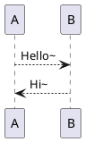

#### 示例2

- 使用关键字`participant` 来声明参与者，就可以对该参与者进行更多的控制。
- 声明的顺序将是（默认的）**显示顺序**。
- 使用这些其他的关键字来声明参与者，将**改变**参与者的表示**形状**。
  - `actor`（角色）
  - `boundary`（边界）
  - `control`（控制）
  - `entity`（实体）
  - `database`（数据库）
  - `collections`（集合）
  - `queue`（队列）

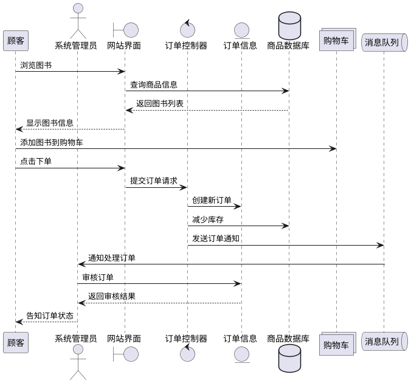

- 使用`as`关键字可以重命名参与者
- 在这里，`->` 表示实现，`-->`表示虚线

#### 示例3

- 箭头大全

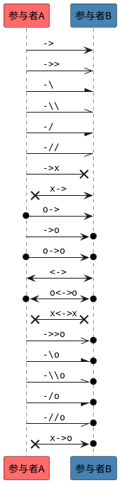

- 看到箭头上面的消息就是代表该箭头的样式了
- 然后`participant` 参与者后面的 `#FF6B6B` 可以给参与者定义背景颜色，颜色自定义

#### 示例4

- 来一个开发中登录授权的图

- 比如我们看一下 `Oauth 2.0`的时序图,语法如下：

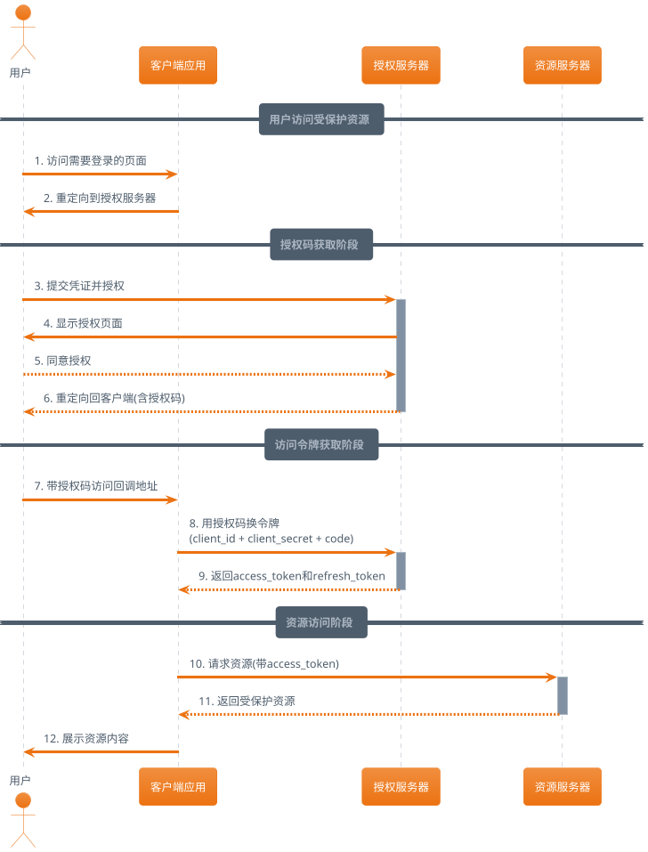

- 展示如下图：

- `@startuml` 和 `@enduml` 表示开始于结束不用说
- 可以通过使用`==`关键词来将图表分割成多个逻辑步骤
- 可以通过手动在文本中添加`\n`使长文本换行
- `!theme aws-orange` 表示主题为`aws-orange` （橙色）主题有如下
- 主题：
  - amiga 
  - aws-orange 
  - black-knight 
  - bluegray 
  - blueprint 
  - carbon-gray 
  - cerulean 
  - cloudscape-design 
  - crt-amber 
  - cyborg 
  - hacker 
  - lightgray 
  - mars 
  - materia 
  - metal 
  - mimeograph 
  - minty 
  - mono 
  - none 
  - plain 
  - reddress-darkblue 
  - reddress-lightblue 
  - sandstone 
  - silver 
  - sketchy 
  - spacelab 
  - Sunlust 
  - superhero 
  - toy 
  - united 
  - vibrant 

> 主题参考链接：https://the-lum.github.io/puml-themes-gallery/themes/index.html
> 

## 四、流程图

- **开始节点**：使用 `start`关键字
- **结束节点**：使用 `stop`或 `end`关键字
- 使用冒号 `:`和分号 `;`将操作步骤括起来 `:活动描述;`
- 如下图示例

### 1、基础语法

  

- 使用 `if`、`then`、`else`和 `endif`关键字来创建条件分支。条件描述后的 `(是)`和 `(否)`会显示在箭头上
  
- 对于多分支判断，可以使用 `elseif`
  

### 2、进阶语法

#### ①、循环

- PlantUML 提供了多种循环方式，**`repeat`循环**是常用的一种

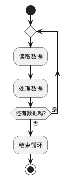

- 相关复杂一点的

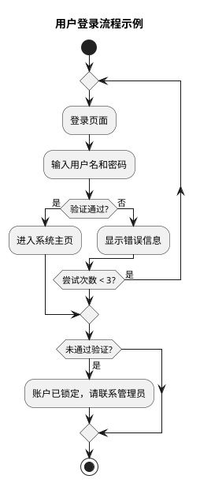

- 还有**while循环**

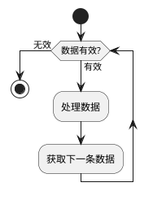

#### ②、并行处理

- 使用 `fork`、`fork again`和 `end fork`或 `end merge`来表示并行执行的分支

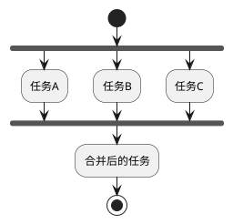

#### ③、分区

- 使用 partition关键字可以将图表中的活动进行逻辑分组，使流程图更具组织性

#### ④、泳道

- **泳道**用于表示不同角色、系统或组件负责的活动，通常用 `|`来定义,你也可以使用 `swimlane`关键字

#### ⑤、注释

- **注释**,你可以使用 `note left`、`note right`、`note top`、`note bottom`来为活动添加注释说明

#### ⑥、颜色与样式

- 你可以使用 `#颜色`标记来为特定元素设置背景色，颜色可以是英文名称（如 `#LightBlue`）或十六进制码（如 `#FF6B6B`）

#### ⑦、综合示例

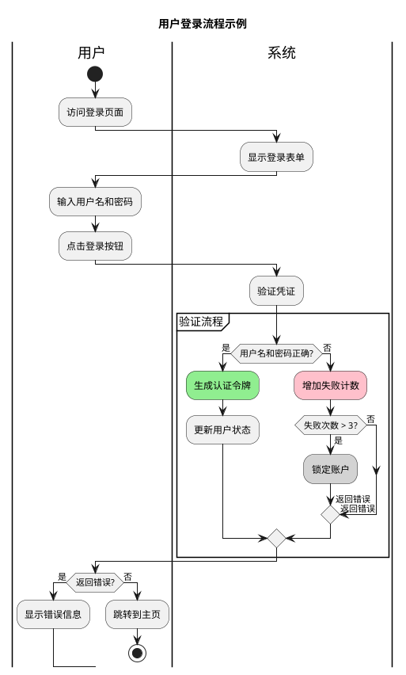

- 泳道和分区、逻辑判断相互结合

## 五、类图

- 类图的设计语法与编程语言的传统语法相似。这种相似性为开发人员提供了一个熟悉的环境，从而使创建图表的过程更简单、更直观。

### 1、基础语法

#### ①、元素声明

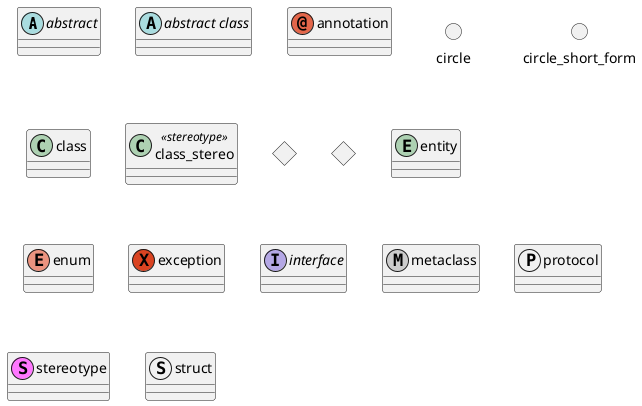

#### ②、定义类

- 使用 `class`关键字来定义一个类。类的成员（字段和方法）写在花括号 `{}`内。

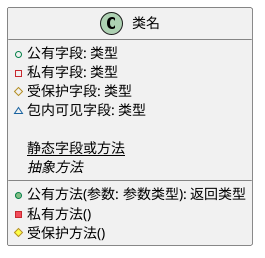

#### ③、访问权限修饰符

- 在 PlantUML 中，使用特定符号来表示类成员的访问权限

| 符号         | 含义        | 说明                                   |
| :----------- | :---------- | :------------------------------------- |
| `+`          | `public`    | 公有，任何类都可访问                   |
| `-`          | `private`   | 私有，仅当前类内部可访问               |
| `#`          | `protected` | 受保护，当前类、同包类及子类可访问     |
| `~`          | `package`   | 包内可见（默认），同包内的类可访问     |
| `{static}`   | 静态成员    | 属于类本身，而非类的实例               |
| `{abstract}` | 抽象方法    | 只有声明，没有实现，必须在子类中被覆盖 |

**类之间的关系**

| **类型** | **符号** | **目的**                 |
| -------- | -------- | ------------------------ |
| 扩展     | `<|--`   | 类在层次结构中的特化     |
| 实现     | `<|..`   | 通过类实现接口           |
| 构成     | `*--`    | 没有整体就没有部分       |
| 聚合     | `o--`    | 部分可以独立于整体而存在 |
| 依赖性   | `-->`    | 对象使用另一个对象       |
| 依赖     | `..>`    | 一种较弱的依赖形式       |

- 可以用`..` 来代替`--` ，会显示为虚线

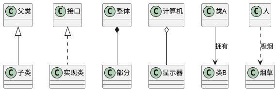

#### ④、包与命名空间

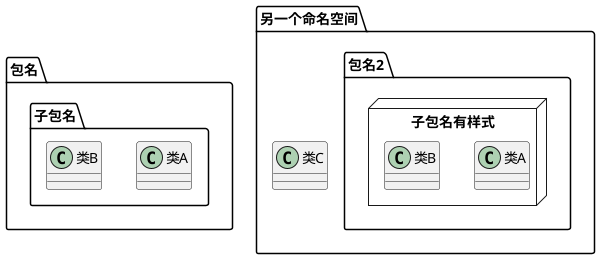

- 通过关键词 `package` 声明包（后面可以加背景颜色）
- `package`后面可以加：`<<Node>> ` 、`<<Rectangle>> `、`<<Folder>> `、`<<Frame>> `、`<<Cloud>> `、`<<Database>> ` 渲染不同的样式

#### ⑤、简单实战示例

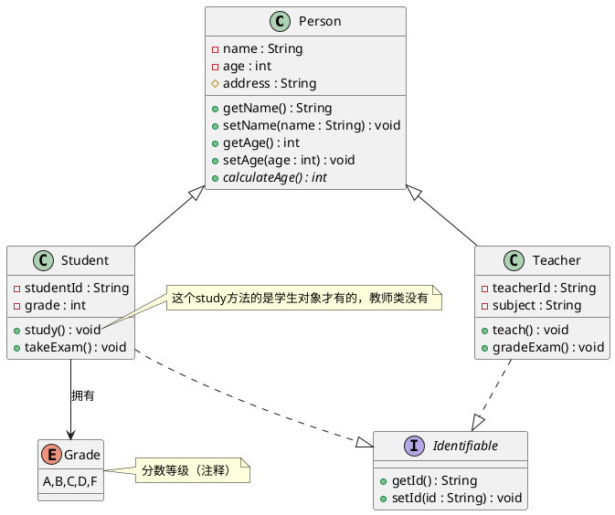

## 六、用例图

- **用例图**是软件工程中的一种可视化表示方法，用于描述**系统角色**与**系统本身**之间的交互

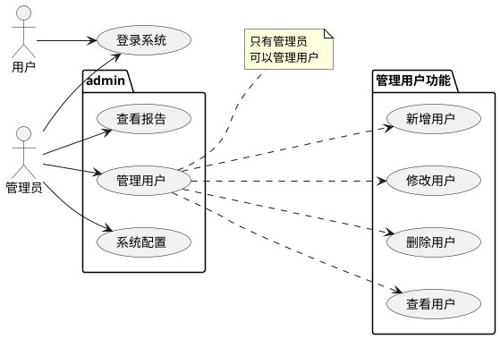

- 可以用`usecase` 关键字来定义一个 用例,也可以直接用`()` 包起来

## 七、总结

- 其实还有很多UML图，语法大差不差的，只要上面的语法都会用，剩下的举一反三，勉强够用了
- 具体的详细文档可参考：[https://plantuml.com/zh/](https://plantuml.com/zh/) 有好多示例。

