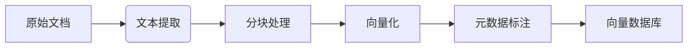
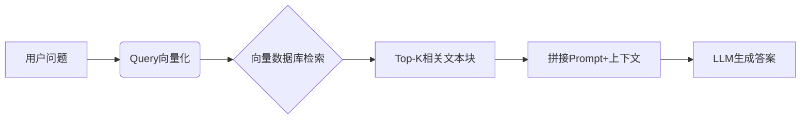

### 一、什么是RAG（Retrieval-Augmented Generation）？

- **检索增强生成（Retrieval Augmented Generation），简称 RAG**，是一种结合了信息检索和生成模型的自然语言处理框架。它通过引入外部知识库（如文档库、数据库等）来增强生成模型，从而提高回答的准确性和相关性，已经成为当前火热的LLM应用方案。
- 简单的讲就是**RAG可以让大模型回答私域知识**
  - 比如你手里有一个富婆通讯录知识库，你可以试试更新这个知识库文档，那AI就可以实时获取到单身富婆的通讯资料
  - 借助RAG技术，可将公司业务数据喂给大模型，从而生成准确且贴合公司需求的数据。

<!--more-->

#### 1、RAG有什么用

- 回答这个问题之前，我们需要知道LLM的缺点
  - LLM 训练一次成本巨大，知识可能很快过时，无法覆盖新事件（如今天的天气）
  -  LLM 有时会**“幻觉”**，即编造看似合理但错误的信息。
  - 还有数据安全性，有些企业有自己的私域数据，不可能会上传到第三方平台训练，所以大模型回答的信息，不可能满足所有人的需求
  
- 所以，RAG的出现就可以解决上面的缺陷，RAG的目的是通过从外部知识库检索相关信息来辅助大语言模型生成更准确、更丰富的文本内容。

  

  

### 二、RAG的工作原理

- RAG 让大型语言模型在回答你的问题时，**不是只靠它自己死记硬背的知识**，而是**懂得实时去翻书（查资料）**，找到最相关的信息片段，然后结合这些信息和你问题本身的上下文，给出更准确、更靠谱、更新鲜的答案。

- **通俗比喻总结：**

  想象你在准备一个很难的考试（用户提问）。

  - **传统 LLM (死记硬背型学霸)：** 只靠考前背过的教科书答题。如果题目超出教科书范围，要么答不上来，要么就可能瞎蒙（幻觉）。
  - **RAG (开卷考试型学霸)：**
    - **听到题目（Retrieve）：** 立刻去翻允许携带的、厚厚的、最新的参考书和资料汇编（资料库），迅速找到与题目最相关的几页内容。
    - **整合信息（Augment）：** 把题目和翻到的这几页资料一起摆在桌面上。
    - **组织答案（Generate）：** 结合自己对知识的理解和面前这些具体的参考资料，写出一份有据可查、准确详细的答卷


**RAG检索过程：**

- 步骤 1：准备知识库（向量化存储）
- 步骤 2：接收用户查询
- 步骤 3：从向量库中检索最相关的文档片段
- 步骤 4：构造 Prompt 并调用大模型生成回答
- 步骤 5：返回结果给用户


#### 1、准备知识库（向量化存储）
- RAG最重要的就是要有知识库
- 我们需要把文档数据转为计算机读懂的语言，把文档向量化存储

**文档存储流程：**





#### 2、RAG检索流程：



- 向量数据库检索,基本都是相似度检索，返回符合用户提问问题的 Top-K 个文本分片
- 修改Prompt提示词，**上下文增强Prompt**，把检索到的相关内容插入进去，辅助大模型进行作答
- 最终返回结果给用户


### 三、RAG代码实战
- 说得再多，不如动手做一遍
- 之前文章已经讲过`spring-ai-alibaba`相关知识，这里我们还是基于`spring-ai-alibaba`进行代码实战

#### 1、首先还是导入依赖

```xml

<dependency>
    <groupId>org.springframework.ai</groupId>
    <artifactId>spring-ai-advisors-vector-store</artifactId>
</dependency>
        
 <dependency>
     <groupId>com.alibaba.cloud.ai</groupId>
     <artifactId>spring-ai-alibaba-starter-dashscope</artifactId>
     <version>1.0.0.2</version>
</dependency>
```

- yml配置我们模型的 apiKey

```yml
spring:
  ai:
    dashscope:
      api-key: sk-rstyro # 这里替换为你的apiKey
```

#### 2、文档转向量
- 我们需要准备我们的知识库文档，把它转为向量存储

```java
@Configuration
public class RagConfig {

    @Bean
    public ChatClient chatClient(ChatClient.Builder clientBuilder) {
        return clientBuilder.defaultSystem("回答问题不懂不要瞎说").build();
    }

    /**
     * SimpleVectorStore 基于内存的向量数据库，用于存储文档的向量表示
     * @param embeddingModel 将文本转换为向量的模型
     */
    @Bean
    public VectorStore vectorStore(EmbeddingModel embeddingModel) {
        SimpleVectorStore simpleVectorStore = SimpleVectorStore.builder(embeddingModel).build();
        // metadata(元数据)用途 ：可用于后续过滤或排序（例如按年份筛选文档）
        List<Document> documents = List.of(
                new Document("单身富婆电话号码：18818868688"),
                new Document("富婆通讯录黄美嘉:15202029914\n" +
                        "舒琳：18697979390\n" +
                        "美玲：18376690119\n" +
                        "何媛：18707455763\n" +
                        "露露：15277166525\n" +
                        "文文：18276405678\n" +
                        "珊珊：18277222776\n" +
                        "李洁：15850471789\n" +
                        "小白：15077014818"),
                new Document("广东富婆姐妹群号码：88888888", Map.of("year", 2025)),
                new Document("1", "群主私密号码：1688", new HashMap<>()));
        // 加载文档知识库
        simpleVectorStore.add(documents);
        return simpleVectorStore;
    }

}

```

- 为了快速演示，这里我们使用 `SimpleVectorStore` 基于内存的向量数据库
- 知识库加载了一些网上富婆的通讯录


#### 3、检索增强

- 我们已经成功创建好知识库，就可以通过`ChatClient`进行检索增强


```java
@Slf4j
@RestController
@RequestMapping("/rag")
public class RagDemoController {

    private static final String DEFAULT_PROMPT = "广东富婆的号码是多少";

    @Resource
    private VectorStore simpleVectorStore;

    @Resource
    private ChatClient chatClient;

    /**
     * 基于知识库数据进行问答。
     */
    @GetMapping("/simple")
    public String simpleRag(@RequestParam(value = "prompt", defaultValue = DEFAULT_PROMPT) String prompt) {
        QuestionAnswerAdvisor questionAnswerAdvisor = new QuestionAnswerAdvisor(simpleVectorStore);
        return chatClient.prompt(prompt).advisors(questionAnswerAdvisor).call().content();
    }


    /**
     * 相似性搜索
     * @param query 检索词
     * @param topK 返回的相似文档数量
     */
    @GetMapping("/search")
    public List<Document> search(@RequestParam(defaultValue = "号码") String query,@RequestParam(defaultValue = "3") Integer topK) {
        log.info("执行相似性搜索，query={},topK={}", query,topK);
        SearchRequest searchRequest = SearchRequest.builder().query(query).topK(topK).build();
        return simpleVectorStore.similaritySearch(searchRequest);
    }

}

```

- 如上`QuestionAnswerAdvisor` 是一个轻量级、开箱即用的 RAG 实现，注入`simpleVectorStore`,通过`advisors()` 就可以进行检索增强了


- 可以看到AI回答的内容确实是通过我们提供的文档来回答的

### 四、RAG与工具对比

- 之前的文章我们已经实战过 “工具（tool-call）” 的使用
- 那RAG与工具有什么区别呢，两者又有什么优缺点呢？
  - 它们都是增强大型语言模型（LLM）能力的技术
  - 但目标、机制和应用场景有本质不同。


**核心比喻：**

- **RAG：** 给 LLM **一本随时可查阅的参考书/知识库**。LLM 在回答问题时，会先去翻这本书找相关段落，然后结合找到的内容和自己的理解写答案。
- **工具：** 给 LLM **一套可以操作外部世界的“瑞士军刀”或“遥控器”**。LLM 根据你的指令，决定调用哪把“刀”（哪个工具/API），把指令翻译成工具能理解的格式发送出去，拿到结果后再解释给你听。


**详细对比分析：**

| 特性             | RAG (检索增强生成)                                           | 工具 (Tool Use / Function Calling)                           |
| :--------------- | :----------------------------------------------------------- | :----------------------------------------------------------- |
| **核心目标**     | **增强 LLM 的知识和信息准确性、时效性、专业性。** 让 LLM 能回答超出其训练数据范围或需要最新/特定知识的问题。 | **扩展 LLM 的行动能力。** 让 LLM 能执行它自身无法完成的任务，如计算、查询实时数据、操作外部系统、控制设备等。 |
| **工作原理**     | 1. **检索：** 将用户问题转化为向量，在**知识库**中查找最相关的文本片段。 2. **增强：** 将问题和检索到的片段一起输入给 LLM。 3. **生成：** LLM 基于问题和提供的片段生成答案。 | 1. **规划/决策：** LLM 理解用户意图，决定是否需要调用工具以及调用哪个工具。 2. **参数化：** LLM 根据工具的定义，生成符合要求的调用参数（如 JSON 结构）。 3. **执行：** 系统（或 Agent 框架）**实际调用外部工具/API** 并获取结果（如数据库返回记录、计算器返回结果、天气 API 返回预报）。 4. **整合：** LLM 将工具返回的结果整合到最终回复中（可能直接展示结果，或用自然语言解释结果）。 |
| **处理对象**     | **文本信息（非结构化或半结构化）。** 知识库通常是文档、网页、PDF、数据库记录等文本片段。 | **数据和动作。** 工具处理的是结构化数据（如数据库查询结果、JSON 返回值）或执行具体动作（如发送邮件、控制开关）。 |
| **依赖核心**     | **向量数据库/检索系统 + 知识库内容。** 答案质量极大依赖于检索到的片段是否相关、准确、全面。 | **外部工具/API 的可用性、功能和稳定性。** LLM 本身不执行操作，只是“指挥者”。 |
| **LLM 角色**     | **信息整合者与叙述者。** LLM 的核心任务是基于检索到的证据生成连贯、准确的文本回答。 | **决策者与翻译官。** LLM 决定何时调用哪个工具，并将用户意图“翻译”成工具能理解的参数指令，再将工具结果“翻译”成用户能理解的自然语言。 |
| **主要优势**     | 克服 LLM 知识静态、易“幻觉”的缺点。 提供可追溯的来源（引用片段）。  利用专有或最新知识。  答案更具体、有据可依。 | 突破 LLM 纯文本处理的限制。  执行实际任务（计算、查询、操作）。  获取实时、动态数据（股票、天气、新闻）。 连接现实世界系统和服务。 |
| **典型应用场景** | 基于公司内部文档的问答系统。  需要引用来源的研究助手。 产品技术支持（基于手册）。  总结长文档特定部分。 | 计算器/单位换算器。  查询实时天气/股票/航班信息。 预订机票/酒店（调用预订 API）。 控制智能家居设备。  在数据库中增删改查记录。 发送邮件/消息。 |
| **输出形式**     | **自然语言文本答案**，通常融合了检索到的信息。               | **可以是：** 工具执行后的**直接结果**（如计算出的数字、查询到的数据表）。  LLM 用**自然语言解释**的工具执行结果。 执行了某个**动作的确认**（如“邮件已发送”）。 |
| **与用户交互**   | 通常是**单次问答**：用户提问 -> RAG 检索+生成 -> 返回答案。  | 可能需要**多轮对话**：用户表达意图 -> LLM 决定调用工具 -> 执行工具 -> 返回结果 -> 用户进一步询问或提出新要求 -> ... |
| **关键区别点**   | **“知道”更多（知识增强）。** 专注于**获取和利用信息**来生成更好的文本。 | **“能做”更多（能力扩展）。** 专注于**执行动作或获取特定数据**。 |

**总结与关键区分点：**

1. **目的不同：**
   - **RAG：** **解决“LLM 不知道或记不清”的问题。** 核心是**信息获取与融合**。目标是让回答**更准确、更新鲜、更有依据**。
   - **工具：** **解决“LLM 做不到”的问题。** 核心是**动作执行与数据交互**。目标是让 LLM **能完成超出文本生成范围的实际任务**。
2. **机制不同：**
   - **RAG：** 是 LLM **内部推理过程的前置步骤**（检索 -> 增强上下文 -> 生成）。依赖的是**静态或定期更新的知识库**。
   - **工具：** 是 LLM **推理过程的外部延伸**（决策 -> 调用 -> 执行 -> 整合）。依赖的是**动态、可交互的外部服务或程序**。工具调用通常涉及**明确的 API 接口和结构化数据交换**。
3. **输出核心不同：**
   - **RAG：** 输出核心是 LLM **生成的文本**，该文本**融合了检索到的信息**。
   - **工具：** 输出核心往往是 **外部工具执行后返回的数据或动作结果**，LLM 主要负责解释或呈现它。

**互补关系：**

虽然区别明显，但 RAG 和 工具 **经常一起使用**，构建更强大的 AI 应用（Agent 架构）：

1. **用 RAG 决定是否需要调用工具：** 用户问“怎么重置我的路由器密码？”。RAG 可以先检索知识库，如果知识库里有明确的步骤文档，就直接回答；如果文档里说需要登录管理界面操作，而登录操作需要调用一个“设备控制”工具，那么系统就可以触发工具调用。
2. **用工具获取的信息作为 RAG 的知识库来源：** 一个工具查询了最新的销售数据库，返回了结构化数据。这些数据可以被处理成文本片段，存入 RAG 的向量知识库，供后续问答使用。
3. **用 RAG 解释工具的结果：** 工具调用一个数据分析 API 返回了一堆复杂的数据图表。RAG 可以利用知识库中关于如何解释这类图表的指南，帮助 LLM 生成更易懂的总结报告。

**简单来说：**

- 你想让 AI **回答一个需要查资料的问题**（比如“公司最新的请假政策是什么？”、“这份合同里关于违约金的条款怎么说？”） -> **用 RAG**。
- 你想让 AI **帮你做一件事或查一个实时数据**（比如“帮我算一下房贷月供”、“看看明天北京的天气”、“把会议总结发邮件给张三”、“打开客厅的灯”） -> **需要用到工具**。

理解这个区别，对于设计和选择合适的技术方案来构建 AI 应用至关重要。


#### 结尾

- **至此，我们已推开了RAG技术的大门。**
- 本文旨在提供一份高效的**RAG入门指南**。真正可落地于市场的RAG系统，还需要集成更复杂的技术组件。
- 比如：**查询预处理、多语言支持、向量检索与文档融合、结果后处理...**

