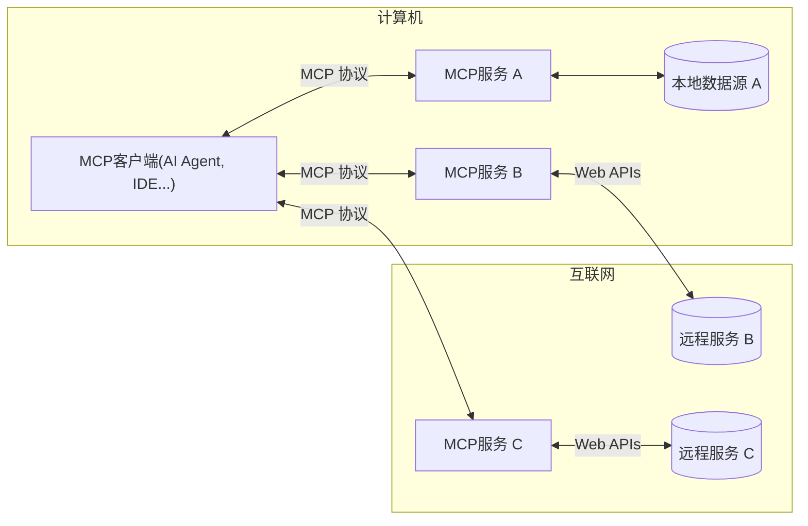

## 一、什么是MCP？

- **MCP（Model Context Protocol）** 是由 **Anthropic** 于2024年11月底推出的**开放通信协议标准**，旨在**统一大语言模型（LLM）与外部数据源、工具和服务之间的交互方式**。它解决了AI系统集成中接口碎片化的问题，类似于为“模型调用工具”制定通用语言。
- MCP协议规范的**Gihub地址**：[https://github.com/modelcontextprotocol/modelcontextprotocol](https://github.com/modelcontextprotocol/modelcontextprotocol)


### 核心价值

- **标准化**：定义统一的请求/响应格式，避免为每个工具开发定制接口。
- **解决痛点**：打破数据孤岛，避免为每个数据源单独开发定制化连接器，降低开发成本。


> *通过MCP，模型只需发送标准化请求即可调用天气API、数据库或企业内部系统，无需关注底层实现差异。*


## 二、为什么使用MCP？

- MCP（ 模型上下文协议 ）通过标准化AI与外部工具、数据源的交互方式，解决了传统函数调用机制存在的能力固化、生态割裂和集成复杂等问题

- **能力固化问题**
	- 传统函数调用依赖静态注册模式，工具能力被预先固化在系统提示词中，模型无法动态感知或使用新增服务。例如，当需要接入新工具时，需重新设计接口描述和提示词模板，导致跨平台适配成本高。

- **生态割裂问题**
	- 不同AI平台（如 OpenAI Functions 、 QwenAgent 、 Google Vertex AI ）采用私有化工具定义格式，开发者需为同一功能维护多套SDK代码。MCP通过统一标准简化跨平台集成，避免重复开发。
- **集成复杂问题**
	- 不同厂商的封闭调用协议导致工具复用困难，即便同一工具在不同平台也需要重新编写调用逻辑。MCP通过开放标准实现模块化连接，降低集成复杂度并提升开发效率。


- MCP通过**协议层标准化**实现突破：

  - **生态互操作性**
    任何兼容MCP的工具（如PostgreSQL/Slack/GitHub）可即插即用，无需重复开发适配器
  - **开发效率飞跃**
    避免重复造轮子，直接复用社区成熟组件（如[阿里云百炼MCP Server列表](https://bailian.console.aliyun.com/console?tab=mcp#/mcp-market)）
  - **无缝增强AI Agent能力**
    Agent通过标准MCP调用链组合多工具（如：天气查询、联网搜索、时区转换....）

###  **关键结论**

MCP不是又一个技术框架，而是**重塑AI工具生态的基础协议**。它像AI世界的`USB Type-C`接口：

- 终结私有化适配的「线缆地狱」
- 让开发者聚焦业务逻辑而非兼容层
- 通过协议级安全释放企业数据价值
- 通过 MCP 服务器和 MCP 客户端，只要大家都遵循这套协议，就能实现“万物互联”

> *正如Anthropic技术负责人所言：
> “MCP的目标是让调用工具像HTTP访问网页一样简单可靠”*


## 三、MCP怎么使用？

- 要使用MCP，首先我们要知道的它的架构：
- **MCP 的核心遵循客户端-服务器架构**，其中主机应用程序可以连接到多个服务器：



> - 从官网介绍页抄的图，链接：https://modelcontextprotocol.io/introduction

- **MCP 主机**：希望通过 MCP 访问数据的： AI Agent、IDE 等程序
- **MCP 客户端**：与服务器保持一对一连接的协议客户端
- **MCP 服务器**：通过标准化MCP协议暴露特定能力的轻量级服务程序
- **本地数据源**：MCP 服务器可以安全访问的计算机文件、数据库和服务
- **远程服务**：MCP 服务器可以连接到互联网上的可用的外部系统（例如，通过 API）


### 1、快速开始

- 从上图，我们大概知道，有一个MCP服务端和MCP客户端，还有它们之间通讯的MCP协议
- 文字表述还是比较空洞，来个代码实战快速入门吧，我们还是以`spring-ai-alibaba` 框架快速演示
- 而Spring AI对MCP的集成有几种方式，如下：

- **客户端启动器：**
    - `spring-ai-starter-mcp-client`- 提供 标准输入/输出 （STDIO）和基于 HTTP 的 SSE 支持
    - `spring-ai-starter-mcp-client-webflux`- 基于 WebFlux 的 SSE 传输实现

- **服务器启动器：**
    - `spring-ai-starter-mcp-server`- 支持标准输入/输出 （STDIO） 传输的核心服务器
    - `spring-ai-starter-mcp-server-webmvc`- 基于 Spring MVC 的 SSE 传输实现
    - `spring-ai-starter-mcp-server-webflux`- 基于 WebFlux 的 SSE 传输实现


- 我们还是以之前RAG的文章富婆Demo为例，我们创建一个MCP服务


#### MCP-SERVER

- **1、导入依赖**

```xml
<dependencies>
    <dependency>
        <groupId>org.springframework.ai</groupId>
        <artifactId>spring-ai-starter-mcp-server-webflux</artifactId>
    </dependency>
</dependencies>
```

- **2、创建一个富婆查询服务**
  - RichWomanService


```java
@Slf4j
@Service
public class RichWomanService {

    private final List<RichWoman> database = new ArrayList<>();
    private final Random random = new Random();

    // 名字生成组件
    private final List<String> chineseSurnames = List.of(
            "李", "王", "张", "刘", "陈", "杨", "黄", "周", "吴", "赵",
            "林", "徐", "孙", "马", "朱", "胡", "郭", "何", "高", "郑"
    );

    private final List<String> femaleGivenNames = List.of(
            "婉如", "雅婷", "思琪", "梦瑶", "欣怡", "雨萱", "晓雯", "静怡", "诗涵", "美玲",
            "慧琳", "嘉欣", "雪梅", "丽华", "春燕", "秋月", "紫薇", "若兰", "芷晴", "慧敏",
            "雅静", "燕妮", "薇薇", "晓彤", "梦洁", "心怡", "玉婷", "思思", "雅雯", "诗琪",
            "雨婷", "慧君", "秀英", "丽娜", "芳芳", "婷婷", "艳艳", "燕燕", "莉莉", "娟娟",
            "琳琳", "丹丹", "萍萍", "颖颖", "璐璐", "晶晶", "敏敏", "倩倩", "婷婷", "雪莲"
    );

    // 已使用名字集合
    private final Set<String> usedNames = new HashSet<>();

    // 国内城市列表
    private final List<String> chineseCities = List.of(
            "北京", "上海", "深圳", "广州", "杭州", "成都", "重庆", "南京",
            "武汉", "苏州", "天津", "西安", "长沙", "青岛", "郑州", "宁波",
            "厦门", "香港", "澳门", "台北", "佛山", "东莞", "无锡", "合肥",
            "昆明", "大连", "沈阳", "济南", "福州", "珠海"
    );

    @JsonIgnoreProperties(ignoreUnknown = true)
    public record RichWoman(
            String name,
            String phone,     // 新增手机号字段
            int age,
            double fortune,  // 资产（单位：亿元）
            String industry,
            String city,
            String hobby
    ) {}

    public RichWomanService() {
        this.initMockData();
    }

//    @PostConstruct
    public void initMockData() {
        // 国内行业
        String[] industries = {"互联网科技", "房地产开发", "金融投资", "生物医药", "新能源",
            "影视娱乐","教育培训", "餐饮连锁", "制造业", "电子商务", "文化传媒", "医疗健康"};

        // 业余爱好
        String[] hobbies = {"收藏珠宝", "环球旅行", "艺术品收藏", "慈善事业", "马术", "品茶",
                "高尔夫", "瑜伽冥想", "古典音乐", "书画收藏", "时尚设计", "国学研习"};

        // 生成50位富婆数据（确保名字不重复）
        for (int i = 0; i < 50; i++) {
            String name;
            do {
                name = generateRandomName();
            } while (usedNames.contains(name));

            usedNames.add(name);

            database.add(new RichWoman(
                    name,
                    generateRandomPhone(),
                    25 + random.nextInt(35), // 25-60岁
                    3 + random.nextDouble() * 97, // 3-100亿资产
                    industries[random.nextInt(industries.length)],
                    chineseCities.get(random.nextInt(chineseCities.size())),
                    hobbies[random.nextInt(hobbies.length)]
            ));
        }

        // 添加几位特别富有的角色（确保名字不重复）
        addSpecialWoman("张雨薇", "深圳", "科技投资", 285.7, "AI研究");
        addSpecialWoman("王雅婷", "杭州", "电子商务", 320.5, "慈善事业");
        addSpecialWoman("李静怡", "香港", "房地产开发", 450.2, "书画收藏");
        addSpecialWoman("陈晓雯", "北京", "新能源", 380.0, "国学研习");
        addSpecialWoman("刘诗涵", "上海", "金融投资", 420.8, "古典音乐");
    }

    // 添加特殊富婆
    private void addSpecialWoman(String name, String city, String industry, double fortune, String hobby) {
        if (!usedNames.contains(name)) {
            usedNames.add(name);
            database.add(new RichWoman(
                    name,
                    generateRandomPhone(),
                    35 + random.nextInt(20), // 35-55岁
                    fortune,
                    industry,
                    city,
                    hobby
            ));
        }
    }

    // 生成随机手机号
    private String generateRandomPhone() {
        // 手机号前缀（中国）
        String[] prefixes = {"130", "131", "132", "133", "134", "135", "136", "137", "138", "139",
                "150", "151", "152", "153", "155", "156", "157", "158", "159",
                "180", "181", "182", "183", "184", "185", "186", "187", "188", "189"};

        String prefix = prefixes[random.nextInt(prefixes.length)];
        StringBuilder sb = new StringBuilder(prefix);

        // 生成后8位数字
        for (int i = 0; i < 8; i++) {
            sb.append(random.nextInt(10));
        }

        return sb.toString();
    }

    // 生成随机中文名
    private String generateRandomName() {
        String surname = chineseSurnames.get(random.nextInt(chineseSurnames.size()));
        String givenName = femaleGivenNames.get(random.nextInt(femaleGivenNames.size()));
        return surname + givenName;
    }

    @Tool(description = "获取所有富婆数据")
    public String findAll() {
        log.info("查询所有富婆");
        return formatRichWomen(database);
    }

    @Tool(description = "通过城市名称获取富婆信息")
    public String findByCityName(String cityName) {
        log.info("查询富婆，cityName={}",cityName);
        List<RichWoman> result = database.stream()
                .filter(w -> w.city().contains(cityName.trim()))
                .toList();
        return formatRichWomen(result);
    }

    @Tool(description = "获取资产在某个数值之上的富婆数据")
    public String findByFortuneGreaterThan(double minFortune) {
        log.info("查询富婆，minFortune={}",minFortune);
        List<RichWoman> result = database.stream()
                .filter(w -> w.fortune() >= minFortune)
                .toList();
        return formatRichWomen(result);
    }

    @Tool(description = "通过关键词搜索富婆信息")
    public String search(String keyword) {
        log.info("查询富婆，keyword={}",keyword);
        String lowerKeyword = keyword.toLowerCase();
        List<RichWoman> result = database.stream()
                .filter(w ->
                        w.name().toLowerCase().contains(lowerKeyword) ||
                                w.phone().contains(keyword) ||
                                w.industry().toLowerCase().contains(lowerKeyword) ||
                                w.city().toLowerCase().contains(lowerKeyword) ||
                                w.hobby().toLowerCase().contains(lowerKeyword)
                )
                .toList();
        return formatRichWomen(result);
    }

    @Tool(description = "通过手机号查找富婆")
    public String findByPhone(@ToolParam(description = "手机号码") String phone) {
        log.info("查询富婆，phone={}",phone);
        Optional<RichWoman> result = database.stream()
                .filter(w -> w.phone().equals(phone))
                .findFirst();
        return result.map(this::formatRichWoman)
                .orElse("未找到手机号[" + phone + "]对应的富婆信息");
    }

    // 格式化单个富婆信息为中文
    private String formatRichWoman(RichWoman woman) {
        return String.format(
                "姓名：%s，手机号：%s，年龄：%d岁，资产：%.1f亿元，行业：%s，所在城市：%s，爱好：%s",
                woman.name(), woman.phone(), woman.age(), woman.fortune(),
                woman.industry(), woman.city(), woman.hobby()
        );
    }

    // 格式化富婆列表为中文（多条用换行分隔）
    private String formatRichWomen(List<RichWoman> women) {
        if (women.isEmpty()) {
            return "未找到符合条件的富婆信息";
        }
        StringBuilder sb = new StringBuilder();
        for (int i = 0; i < women.size(); i++) {
            sb.append(i + 1).append(". ").append(formatRichWoman(women.get(i)));
            if (i < women.size() - 1) {
                sb.append("\n");
            }
        }
        return sb.toString();
    }
}
```

- 上面我们定义了几个富婆查询的方法，可以看有`@Tool`注解的方法
- 然后我们构建一个 `ToolCallbackProvider`工具提供者,注入成一个bean，如下：

```java
@Configuration
public class McpServerConfig {

    @Bean
    public ToolCallbackProvider richWomanTools(RichWomanService richWomanService) {
        return MethodToolCallbackProvider.builder()
                .toolObjects(richWomanService).build();
    }

}
```

- **3、配置MCP服务**

- 编辑application.yml定义我们服务的名称与版本等信息

  ```yml
  server:
    port: 8091
  
  spring:
    application:
      name: mcp-server-webflux
    ai:
      mcp:
        server:
          name: rich-woman-server
          version: 0.0.1
          type: ASYNC
          sse-endpoint: /sse
          sse-message-endpoint: /mcp
          instructions: 这个是中国富婆信息查询和资源
          capabilities:
            tool: true
            resource: true
            prompt: true
            completion: true
  
  
  
  ```

- 上面配置好了我们把服务启动起来


#### MCP-CLIENT

- 上面我们已经创建好，mcp服务，接下面我们就可以建立一个mcp客户端来调用它了
- 上面使用：`spring-ai-starter-mcp-server-webflux`对应的使用：`spring-ai-starter-mcp-client-webflux`


- **1、导入依赖**

```xml
    <dependencies>

        <dependency>
            <groupId>org.springframework.boot</groupId>
            <artifactId>spring-boot-starter-web</artifactId>
        </dependency>

        <dependency>
            <groupId>org.springframework.ai</groupId>
            <artifactId>spring-ai-starter-mcp-client-webflux</artifactId>
        </dependency>

        <dependency>
            <groupId>com.alibaba.cloud.ai</groupId>
            <artifactId>spring-ai-alibaba-starter-dashscope</artifactId>
        </dependency>

    </dependencies>
```

- **2、配置application.yml**

```yml
server:
  port: 8092
  servlet:
    encoding:
      charset: UTF-8
      enabled: true
      force: true

spring:
  application:
    name: mcp-client-webflux
  ai:
    dashscope:
      api-key: ${AI_DASHSCOPE_API_KEY}
    mcp:
      client:
        sse:
          connections:
          # 这里配置我们刚才的mcp服务地址列表
            richWoman:
              # 实际的连接地址为：http://localhost:8091/sse/mcp
              url: http://localhost:8091/
        toolcallback:
          enabled: true

  mandatory-file-encoding: UTF-8


# 调试日志
logging:
  level:
    io:
      modelcontextprotocol:
        client: DEBUG
        spec: DEBUG
```


- **3、使用示例：**

```java
@RequestMapping("/client")
@RestController
public class DemoController {

    private final ChatClient chatClient;

    @Resource
    private ToolCallbackProvider toolCallbackProvider;

    public DemoController(ChatClient.Builder chatClientBuilder) {
        this.chatClient = chatClientBuilder
                .build();
    }

    @GetMapping("/ask")
    public Flux<String> ask(@RequestParam(value = "question", defaultValue = "给我推荐几个资产超过30亿元的富婆") String question) {
        return chatClient
                .prompt(question)
                .toolCallbacks(toolCallbackProvider)
                .stream()
                .content();
    }

}
```

- 我们可以在构建ChatClient的时候，通过配置`defaultToolCallbacks()` 方法转入`ToolCallbackProvider`或者在调用ChatClient时设置`toolCallbacks` 传入：`ToolCallbackProvider` 

- 下面是演示结果图片：


### 2、第三方工具使用MCP服务


- 我们除了使用IDEA的方式调用MCP服务，我们也可以通过 `Cherry Studio` 等软件来配置MCP服务使用，如下：


- 首先需要配置MCP服务，从左下角点击设置->MCP服务，把我们的服务地址写入然后保存


- 在消息对话的时候，点击MCP服务，添加我们上面添加的富婆MCP服务，然后就可以对话了


- 可以看到我们提问的时候，去调用了MCP服务的`findByCityName`的方法，通过返回数据给AI大模型，然后在过滤返回给我们。


## 四、MCP和Tool Calling的区别

MCP（Model Context Protocol，模型上下文协议）和 Tool Calling（工具调用）是两种解决大模型与外部工具/数据源交互的技术方案，但它们在架构设计、协议标准化、安全性等方面存在显著差异。


- **Tool Calling**
  **模型内置的能力**，指大模型根据用户请求，主动解析并生成结构化调用指令（如JSON格式），触发外部工具执行（如查询天气、数据库）。其核心是**模型自身的能力扩展**，与特定AI平台强绑定（如OpenAI的Function Calling）
- **MCP**
  **独立于模型的开放协议**，采用**客户端-服务器架构**（Client-Server）。MCP客户端（如Claude Desktop、IDE插件）向MCP服务器（如本地文件系统、GitHub API服务）发送标准化请求，服务器执行操作后返回结果。MCP的核心是**构建模型与工具间的通用桥梁**，与模型无关。


以下是详细对比：

| **维度**       | **MCP（模型上下文协议）**            | **传统Tool Calling**              |
| :------------- | :--------- | :---------------------------- |
| **架构模式**  | 模型 → MCP客户端 ↔ MCP服务器 → 工具（解耦）  | 模型 → 宿主程序 → 工具（紧耦合） |
| **标准化** | 开放标准，跨模型兼容         | 平台私有，碎片化 |
| **上下文支持** | 支持复杂上下文同步与更新 | 仅传递调用参数     |
| **安全性**     | 协议层强制权限管控                   | 依赖开发者自行实现                |
| **扩展性**     | 动态发现工具/版本管理      | 静态预定义工具列表             |
| **适用场景** | 简单单次调用、快速原型 | 企业复杂系统、敏感数据、长期可扩展应用 |


- **举个栗子🌰：**
  - **传统方案**：每次新增工具都要重新训练模型适配，堪比给汽车换发动机才能加装新音响
  - **MCP方案**：像给汽车装USB接口，插U盘播音乐/接导航仪/连行车记录仪即插即用
             

**立刻体验**：

- Star MCP官方GitHub：https://github.com/modelcontextprotocol
- 部署文中富婆查询Demo：[https://github.com/rstyro/spring-ai-alibaba-demo](https://github.com/rstyro/spring-ai-alibaba-demo)
- 用Cherry Studio可视化调试（截图见上文)
