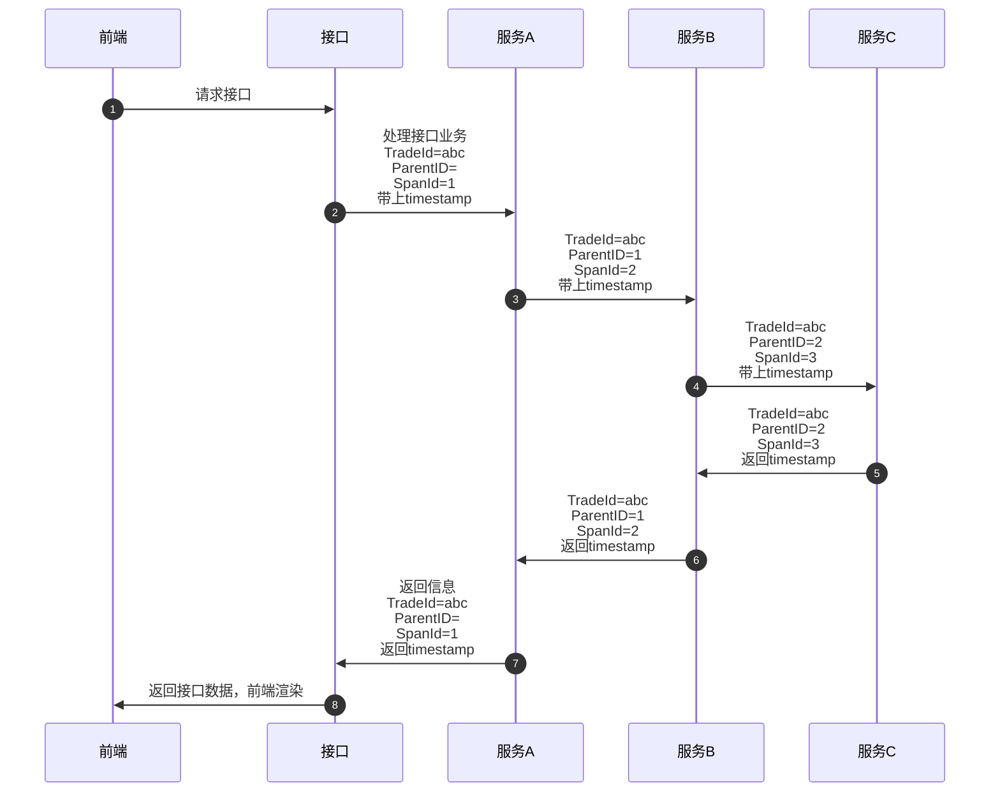
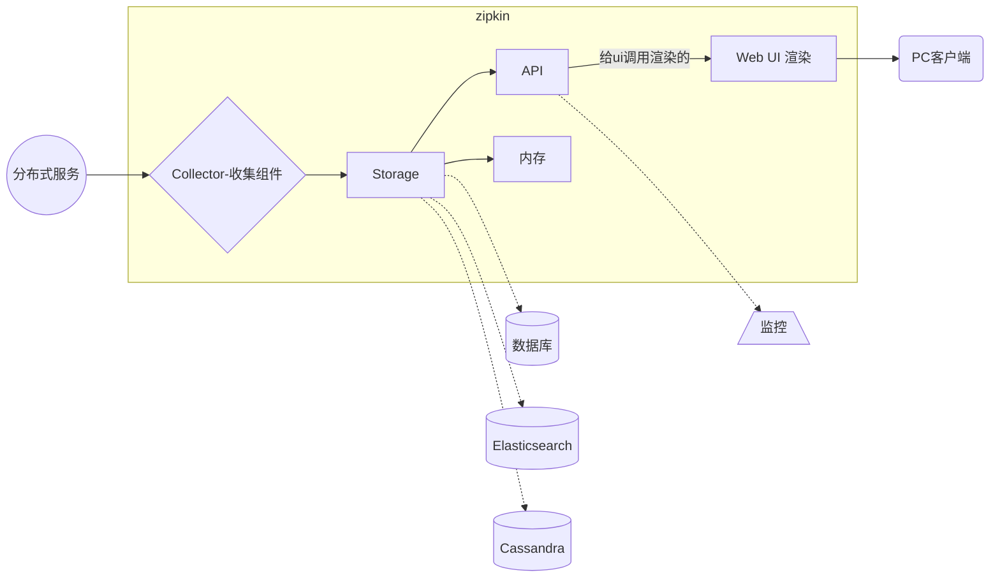

### 一、前言
+ 当一个分布式系统服务多了之后，前端访问接口可能涉及到多个服务调用链路
+ 随着服务的越来越多，对调用链的分析会越来越复杂
+ 当前端访问接口出现问题的时候，我们如何快速定位是哪个服务出现故障比较麻烦
+ 链路追踪的出现正是为了解决这种问题。

### 二、Sleuth
+ 链路追踪”一词是在 2010 年提出的，当时谷歌发布了一篇 Dapper 论文：[Dapper,大规模分布式系统的跟踪系统](http://bigbully.github.io/Dapper-translation/)，介绍了谷歌自研的分布式链路追踪的实现原理，还介绍了他们是怎么低成本实现对应用透明的。
+ 链路追踪简单理解就是将一次分布式请求还原成调用链路，将一次分布式请求的调用情况集中展示，比如，各个服务节点上的耗时、请求具体到达哪台机器上、每个服务节点的请求状态等等。
+ 除了谷歌的 Dapper，还有一些其他比较有名的产品，
+ 比如阿里的鹰眼、大众点评的 CAT、Twitter 的 Zipkin、PinPoint 以及国产开源SkyWalking（已贡献给 Apache） 等。
+ 而Spring Cloud Sleuth 是Spring Cloud 实现了分布式链路跟踪解决方案。Sleuth 提供了以下功能：
    + **链路追踪：**通过 Sleuth 可以很清楚的看出一个请求都经过了那些服务，可以很方便的理清服务间的调用关系等。
    + **性能分析：**通过 Sleuth 可以很方便的看出每个采样请求的耗时，分析哪些服务调用比较耗时，当服务调用的耗时随着请求量的增大而增大时， 可以对服务的扩容提供一定的提醒。
    + **数据分析：**对于频繁调用一个服务，或并行调用等，可以针对业务做一些优化措施。
    + **可视化错误：**对于程序未捕获的异常，可以配合 Zipkin 查看。


#### 1、Sleuth术语
Spring Cloud Sleuth沿用了Google的开源项目Dapper的专业术语。

+ **Span：** 
基本工作单位，一次单独的调用链可以称为一个 Span，通过一个64位ID标识它，  span通过还有其他的数据，例如描述信息，时间戳，key-value对的(Annotation)tag信息，parent-id等,其中parent-id  可以表示span调用链路来源，通俗的理解span就是一次请求信息
+ **Trace：** 
一系列 Span 组成的树状结构，一个 Trace 认为是一次完整的链路，内部包含 n 多个 Span。Trace 和 Span 存在一对多的关系，Span 与 Span 之间存在父子关系。
+ **Annotation：**
	注解,用来记录请求特定事件相关信息(例如时间)，通常包含四个注解信息
	+ *cs：* Client Start,表示客户端发起请求
	+ *sr：* Server Receive,表示服务端收到请求。如果sr减去cs时间戳可得网络延迟；
	+ *ss：* Server Send,表示服务端完成处理（并将结果发送给客户端），如果ss减去sr可得服务端处理请求需要的时间
	+ *cr：* Client Received,表示客户端获取到服务端返回信息,如果cr减去cs时间戳可得客户端从服务端获取回复的所有所需时间。


#### 2、实现原理



+ 我们可以在代码中看到TradeId与SpanId，如下图


+ 虽然能看到信息，但是不太直观，显得更懵逼，鬼知道TradeId与SpanId是哪个服务
+ 所以一般sleup都会配合zipkin一起使用，而且SpringCloud也提供了`spring-cloud-sleuth-zipkin`来方便集成zipkin实现


### 三、Zipkin
+ zipkin是一款开源的分布式实时数据追踪系统（Distributed Tracking System），基于 Google Dapper的论文设计而来，由 Twitter 公司开发贡献。
+ 它有助于收集对服务架构中的延迟问题进行故障排除所需的计时数据。功能包括收集和查找这些数据。


#### 1、zipkin核心组成
+ **Collector：收集器组件**
它主要用于处理从外部系统发送过来的跟踪信息，将这些信息转换为Zipkin内部处理的Span格式，以支持后续的存储、分析、展示等功能。
+ **Storage：存储组件**
它主要对处理收集器接收到的跟踪信息，默认会将这些信息存储在内存中，我们也可以修改此存储策略，通过使用其他存储组件将跟踪信息存储到 数据库或es 中。
+ **RESTful API：API组件**
它主要用来提供外部访问接口。比如给客户端展示跟踪信息，或是外接系统访问以实现监控等。
+ **Web UI：UI组件**
基于API组件实现的上层应用。通过UI组件用户可以方便而有直观地查询和分析跟踪信息。




+ Zipkin 分为两端，一个是 Zipkin 服务端，一个是 Zipkin 客户端
+ 客户端也就是微服务的应用，客户端会配置服务端的 URL 地址
+ 一旦发生服务间的调用的时候，会被配置在微服务里面的 Sleuth 的监听器监听，并生成相应的 Trace 和 Span 信息发送给服务端。
+ 发送的方式有两种：1、消息总线如：（ACTIVEMQ、RABBIT、KAFKA)、2、HTTP的方式


#### 3、快速开始
+ Github源码地址：[https://github.com/openzipkin/zipkin](https://github.com/openzipkin/zipkin)
+ 最快的入门方法是获取最新发布的服务器可执行 jar。*请注意，Zipkin 服务器需要最低 JRE 8。*
+ Jar下载地址：[https://search.maven.org/remote_content?g=io.zipkin&a=zipkin-server&v=LATEST&c=exec](https://search.maven.org/remote_content?g=io.zipkin&a=zipkin-server&v=LATEST&c=exec)

```bash

# wget 下载jar包,并重命名为：zipkin.jar
wget -O zipkin.jar 'https://search.maven.org/remote_content?g=io.zipkin&a=zipkin-server&v=LATEST&c=exec'

# 上面是下载，下面这个也是，官方的快速执行脚本，其实也是下载和上面差不多。
# curl -sSL https://zipkin.io/quickstart.sh | bash -s

# 启动zipkin
java -jar zipkin.jar
```

+ 如上，即可启动一个zipkin服务


+ 访问`http://127.0.0.1:9411/` 应该是没问题的，只是现在没啥东西，不慌慢慢来。


#### 4、sleuth与zipkin的关系
+ Sleuth已经将每个请求从开始调用到完成的每一步都进行了记录， 但是这些log信息会很分散，使用起来不太方便，就需要有一个工具可以将这些信息进行收集和汇总，并且显示可视化的结果，便于分析和定位。
+ sleuth的作用是在系统中自动埋点并把数据发送给zipkin，zipkin的作用是存储这些数据并展现。


### 四、代码实现
+ 说再多还是不会，实现看看效果

#### 1、引入依赖
+ 只需要引入依赖

```
<dependency>
    <groupId>org.springframework.cloud</groupId>
    <artifactId>spring-cloud-starter-zipkin</artifactId>
</dependency>
```

**其实spring-cloud-starter-zipkin里面的依赖包含了：**
```
<dependency>
    <groupId>org.springframework.cloud</groupId>
    <artifactId>spring-cloud-starter-sleuth</artifactId>
</dependency>
<dependency>
    <groupId>org.springframework.cloud</groupId>
    <artifactId>spring-cloud-sleuth-zipkin</artifactId>
</dependency>
```

#### 2、配置sleuth与zipkin
+ 在application.yml添加如下：

```yml
spring:
# 调用链 Sleuth + ZipKin
  sleuth:
    web:
      client:
        # 是否启用 webClient
        enabled: true
    sampler:
      probability: 1.0 # 采用比例，默认 0.1 全部采样 1.0
  zipkin:
    enabled: true
    base-url: http://127.0.0.1:9411/ # 指定了Zipkin服务器的地址
    # 不注册成一个服务
    discoveryClientEnabled: false
    sender:
      #  数据传输方式，web 表示以 HTTP 报文的形式向服务端发送数据，还有kafka 、ACTIVEMQ 等
      type: web
```

#### 3、调用其他服务demo
+ `nacos-provider`是其他服务的注册服务名称（随便写了下）


```java
@RestController
@RequestMapping("/test")
public class TestController {

    RestTemplate loadRestTemplate;
    @Autowired
    public void setLoadRestTemplate(RestTemplate loadRestTemplate) {
        this.loadRestTemplate = loadRestTemplate;
    }
    
    @GetMapping("/hello")
    public String hello(String name){
        Result result = loadRestTemplate.getForObject("http://nacos-provider/test/sayHi?name="+name, Result.class);
        return "访问provider 返回 : " + result;
    }
}
```

#### 4、请求
+ 随便在网页请求`/test/hello`,然后查看zipkin


#### 5、完整代码
+ **Github:** [https://github.com/rstyro/SpringCloud-Alibaba-learning/tree/main/springcloud-sleuth](https://github.com/rstyro/SpringCloud-Alibaba-learning/tree/main/springcloud-sleuth)
+ **Gitee:**  [https://gitee.com/rstyro/SpringCloud-Alibaba-learning/tree/main/springcloud-sleuth](https://gitee.com/rstyro/SpringCloud-Alibaba-learning/tree/main/springcloud-sleuth)


### 五、zipkin配置数据库
+ zipkin数据默认存储在内存中的，如果重启了数据就没有了
+ 可以把数据存在第三方工具中，如：mysql、elasticsearch、等

#### 1、存储到MySQL
+ 创建数据库，并导入初始化sql脚本
+ 初始化sql脚本在：[https://github.com/openzipkin/zipkin/blob/master/zipkin-storage/mysql-v1/src/main/resources/mysql.sql](https://github.com/openzipkin/zipkin/blob/master/zipkin-storage/mysql-v1/src/main/resources/mysql.sql)

```
CREATE TABLE IF NOT EXISTS zipkin_spans (
  `trace_id_high` BIGINT NOT NULL DEFAULT 0 COMMENT 'If non zero, this means the trace uses 128 bit traceIds instead of 64 bit',
  `trace_id` BIGINT NOT NULL,
  `id` BIGINT NOT NULL,
  `name` VARCHAR(255) NOT NULL,
  `remote_service_name` VARCHAR(255),
  `parent_id` BIGINT,
  `debug` BIT(1),
  `start_ts` BIGINT COMMENT 'Span.timestamp(): epoch micros used for endTs query and to implement TTL',
  `duration` BIGINT COMMENT 'Span.duration(): micros used for minDuration and maxDuration query',
  PRIMARY KEY (`trace_id_high`, `trace_id`, `id`)
) ENGINE=InnoDB ROW_FORMAT=COMPRESSED CHARACTER SET=utf8 COLLATE utf8_general_ci;

ALTER TABLE zipkin_spans ADD INDEX(`trace_id_high`, `trace_id`) COMMENT 'for getTracesByIds';
ALTER TABLE zipkin_spans ADD INDEX(`name`) COMMENT 'for getTraces and getSpanNames';
ALTER TABLE zipkin_spans ADD INDEX(`remote_service_name`) COMMENT 'for getTraces and getRemoteServiceNames';
ALTER TABLE zipkin_spans ADD INDEX(`start_ts`) COMMENT 'for getTraces ordering and range';

CREATE TABLE IF NOT EXISTS zipkin_annotations (
  `trace_id_high` BIGINT NOT NULL DEFAULT 0 COMMENT 'If non zero, this means the trace uses 128 bit traceIds instead of 64 bit',
  `trace_id` BIGINT NOT NULL COMMENT 'coincides with zipkin_spans.trace_id',
  `span_id` BIGINT NOT NULL COMMENT 'coincides with zipkin_spans.id',
  `a_key` VARCHAR(255) NOT NULL COMMENT 'BinaryAnnotation.key or Annotation.value if type == -1',
  `a_value` BLOB COMMENT 'BinaryAnnotation.value(), which must be smaller than 64KB',
  `a_type` INT NOT NULL COMMENT 'BinaryAnnotation.type() or -1 if Annotation',
  `a_timestamp` BIGINT COMMENT 'Used to implement TTL; Annotation.timestamp or zipkin_spans.timestamp',
  `endpoint_ipv4` INT COMMENT 'Null when Binary/Annotation.endpoint is null',
  `endpoint_ipv6` BINARY(16) COMMENT 'Null when Binary/Annotation.endpoint is null, or no IPv6 address',
  `endpoint_port` SMALLINT COMMENT 'Null when Binary/Annotation.endpoint is null',
  `endpoint_service_name` VARCHAR(255) COMMENT 'Null when Binary/Annotation.endpoint is null'
) ENGINE=InnoDB ROW_FORMAT=COMPRESSED CHARACTER SET=utf8 COLLATE utf8_general_ci;

ALTER TABLE zipkin_annotations ADD UNIQUE KEY(`trace_id_high`, `trace_id`, `span_id`, `a_key`, `a_timestamp`) COMMENT 'Ignore insert on duplicate';
ALTER TABLE zipkin_annotations ADD INDEX(`trace_id_high`, `trace_id`, `span_id`) COMMENT 'for joining with zipkin_spans';
ALTER TABLE zipkin_annotations ADD INDEX(`trace_id_high`, `trace_id`) COMMENT 'for getTraces/ByIds';
ALTER TABLE zipkin_annotations ADD INDEX(`endpoint_service_name`) COMMENT 'for getTraces and getServiceNames';
ALTER TABLE zipkin_annotations ADD INDEX(`a_type`) COMMENT 'for getTraces and autocomplete values';
ALTER TABLE zipkin_annotations ADD INDEX(`a_key`) COMMENT 'for getTraces and autocomplete values';
ALTER TABLE zipkin_annotations ADD INDEX(`trace_id`, `span_id`, `a_key`) COMMENT 'for dependencies job';

CREATE TABLE IF NOT EXISTS zipkin_dependencies (
  `day` DATE NOT NULL,
  `parent` VARCHAR(255) NOT NULL,
  `child` VARCHAR(255) NOT NULL,
  `call_count` BIGINT,
  `error_count` BIGINT,
  PRIMARY KEY (`day`, `parent`, `child`)
) ENGINE=InnoDB ROW_FORMAT=COMPRESSED CHARACTER SET=utf8 COLLATE utf8_general_ci;

```

+ 启动zipkin的时候添加参数即可。
+ 如下：

```bash
# STORAGE_TYPE: 存储类型：mysql、elasticsearch等
java -jar zipkin-server-2.23.2-exec.jar --STORAGE_TYPE=mysql --MYSQL_HOST=localhost --MYSQL_TCP_PORT=3306 --MYSQL_USER=root --MYSQL_PASS=root --MYSQL_DB=zipkin
```